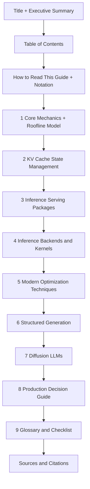

# Enhancement Plan — AI-LLM Inference Technical Guide

**Target file:** [`references_doc/inferencing/AI-LLM Inference Technical Guide.md`](references_doc/inferencing/AI-LLM%20Inference%20Technical%20Guide.md)

**Goal:** Perform a full house-style overhaul of the inference guide by merging the richer source report (RoPE, MLA latent dimensions, Online Softmax rescaling, SRouter, hardware balances, etc.) and applying the repository documentation conventions used by the sibling docs in [`references_doc/quantization/`](references_doc/quantization/presentation_script.md:1) and [`references_doc/mini_pattern_for_AI/`](references_doc/mini_pattern_for_AI/README.md:1).

**Hard constraint:** All 92 existing numbered citations in the `Nguồn trích dẫn` list must be preserved and remain aligned to the content that references them.

---

## House-Style Conventions To Adopt

| Convention | Source Pattern |
| :--- | :--- |
| Title + blockquote subtitle | Quantization survey |
| `Table of Contents` with anchor links | [LLM Quantization Methods Survey](references_doc/quantization/LLM%20Quantization%20Methods%20Survey.md:7) |
| `Executive Summary` / Quick Selection Matrix | [LLM Quantization Methods Survey](references_doc/quantization/LLM%20Quantization%20Methods%20Survey.md:21) |
| Applicability tiers 🟢 API / 🟡 Self-Hosted / 🔴 Infra | [optimization.md](references_doc/optimization.md:11) |
| Comparison tables (Markdown pipe tables) | Multiple sibling docs |
| Mermaid diagrams with anchor-safe labels | [quantization_visuals.md](references_doc/quantization/quantization_visuals.md:305) |
| LaTeX math for core formulas | [LLM Quantization Methods Survey](references_doc/quantization/LLM%20Quantization%20Methods%20Survey.md:43) |
| Bilingual heading support (EN primary, VI citations retained) | agentic docs |

**Mermaid safety rule:** no `"` and no `()` inside `[]` node labels.

---

## Proposed Document Map

---

## Section-By-Section Plan

### 0. Front Matter
- **Executive Summary** blockquote: one paragraph framing the memory-bandwidth bottleneck thesis.
- **TL;DR key-numbers table:** H100 / H200 / B200 compute + bandwidth + machine balance; FA3/FA4 TFLOPs; PagedAttention VRAM utilization; MLA KV reduction %; disaggregation capacity gain.
- **Table of Contents** with anchor links to all H2 sections.

### 1. How to Read This Guide
- Applicability-tier legend (🟢 / 🟡 / 🔴) reused from [optimization.md](references_doc/optimization.md:11).
- Notation: `WxAy` precision, `KVn` cache precision, TTFT, TPOT/ITL, TP, GEMM, HBM, SRAM, SFU, TMA, WGMMA.

### 2. Core Mechanics of LLM Inference and the Roofline Model
- Expand tokenization → embedding → RoPE positional awareness → attention/FFN input flow (from source report).
- Add autoregressive conditional-probability formula:
  $$P(t_{n+1} \mid t_1, \dots, t_n)$$
- Prefill vs Decode contrast captured in a comparison table (compute-bound vs bandwidth-bound, TTFT vs TPOT, arithmetic intensity).
- **Machine-balance math:** H100 SXM 989 TFLOPS FP16 ÷ 3.35 TB/s ≈ 295 FLOPs/byte; decode at batch 1 ≈ ~1 FLOP/byte → 99% core idle.
- **New hardware table:**

  | GPU | FP16 Compute | HBM BW | Machine Balance | Notes |
  | :-- | :-- | :-- | :-- | :-- |
  | H100 SXM | 989 TFLOPS | 3.35 TB/s | ~295 FLOPs/byte | Hopper |
  | H200 | ~989 TFLOPS | 4.8 TB/s | ~206 FLOPs/byte | +43% decode vs H100 |
  | B200 | Higher FP16 | 8.0 TB/s | Lower | Blackwell, addresses autoregressive BW |

- Add **roofline Mermaid diagram** (ridge point, prefill above / decode below).

### 3. State Management and the Anatomy of the KV Cache
- Reframe KV cache as a compute-for-memory trade with a size formula:
  $$\text{KV bytes} = 2 \times L \times H \times d_{head} \times \text{seq\_len} \times \text{batch} \times \text{bytes/dtype}$$
- **PagedAttention:** add Mermaid diagram (logical sequence → block table → non-contiguous physical blocks), restore "60–80% fragmentation → ~96% utilization, 2–4× batch" figures.
- **RadixAttention:** add Mermaid radix-tree diagram (shared system prompt prefix, LRU eviction, ref counting, cache-hit skips prefill).
- **MLA:** restore latent dim detail (512-dim latent + 64-dim RoPE ≈ >90% reduction) and the Weight Absorption trick (absorb up-projection into Q/O weights).
- **New comparison table:** PagedAttention vs RadixAttention vs MLA — what it optimizes, mechanism, sharing capability, compression ceiling, source citation.

### 4. Inference Serving Packages
- Keep vLLM / SGLang / llama.cpp prose, add:
- **Comparison table:**

  | Engine | Core Mechanism | Best For | Hardware | Key Gotcha |
  | :-- | :-- | :-- | :-- | :-- |
  | vLLM | PagedAttention + Continuous Batching | general high-throughput | NVIDIA, AMD, TPU, Gaudi | simplest default |
  | SGLang | RadixAttention + SRouter | agentic / prefix-heavy / RAG | NVIDIA (Rust router) | cache-aware routing assumption |
  | llama.cpp | GGUF + mmap + layer offload | edge / local CPU+GPU | CPU + consumer GPU | FA + asymmetric KV needs `FA_ALL_QUANTS` |

- **SRouter Mermaid flow:** request → approximate cluster radix tree → route to worker already holding prefix → cache hit.

### 5. Inference Backends and Kernels
- Add **attention evolution table:** vanilla attention / FlashAttention-2 / FA3 / FA4 / FlashInfer — architecture target, key primitives, memory technique, headline throughput.
- Add **FlashAttention tiling Mermaid diagram:** Q/K/V blocks in SRAM, no `N×N` HBM materialization.
- Restore and render the **Online Softmax rescaling formula** by $e^{m_{old} - m_{new}}$.
- Restore FA4 details: `tcgen05.mma`, TMEM, 2-CTA MMA, FMA-emulated exponentials, ~1600 TFLOPs/s BF16 on B200.

### 6. Modern Inference Optimization Techniques
- **Disaggregation and Chunked Prefill:** add Mermaid diagram contrasting chunked-prefill interleave vs prefill/decode disaggregation pools connected by NVLink/RDMA.
- Keep the "KV transfer tax" caveat and the 1.5×–3× capacity figure.
- **Advanced Quantization:** add comparison table (AWQ / GPTQ / SmoothQuant / FP8 / NVFP4 / MXFP) with precision, mechanism, hardware, citation. Cross-link to the sibling survey [`LLM Quantization Methods Survey.md`](references_doc/quantization/LLM%20Quantization%20Methods%20Survey.md:1) to avoid duplication.
- **Speculative Decoding and MTP:** add variant table (Classic draft-model / Medusa / EAGLE-2 / MTP) with mechanism, acceptance rate, speedup, citation. Restore lossless rejection-sampling guarantee with the residual-distribution formula.
- **Structured Generation with XGrammar:** add FSM-vs-PDA Mermaid diagram; keep 2×–10× speedup and async bitmask details.
- **Diffusion LLMs:** add Mermaid parallel-annealing diagram (noise canvas → EntropyBoundSampler → lock low-entropy tokens → refine remainder).

### 7. Production Decision Guide (New)
- Workload-to-engine selection table (chat / RAG / agents / edge / long-context).
- Decision flowchart Mermaid: is it prefix-heavy → SGLang; general throughput → vLLM; edge → llama.cpp; FLOP/bandwidth contention → disaggregation.
- Cost/latency reality check table.

### 8. Glossary, Checklist, and Sources
- **Production deployment checklist** (continuous batching, prefix caching, KV quantization, chunked prefill, prefix-stable prompt ordering, observability on TTFT/TPOT).
- **Glossary/acronym table.**
- **Sources and Citations:** preserve the existing `#### Nguồn trích dẫn` heading and all 92 numbered entries verbatim; add a small "Section → Citation" mapping table above it, and rename any newer citations consistently.

---

## Verification Criteria
- [ ] All 92 original citations still present, in order, with unchanged URLs.
- [ ] Every inline citation marker resolves to a real list entry.
- [ ] All Mermaid blocks parse (no `"` / `()` inside `[]`).
- [ ] All LaTeX renders in standard Markdown math.
- [ ] TOC anchors resolve to existing headings.
- [ ] No content duplicated from the quantization survey without cross-linking.