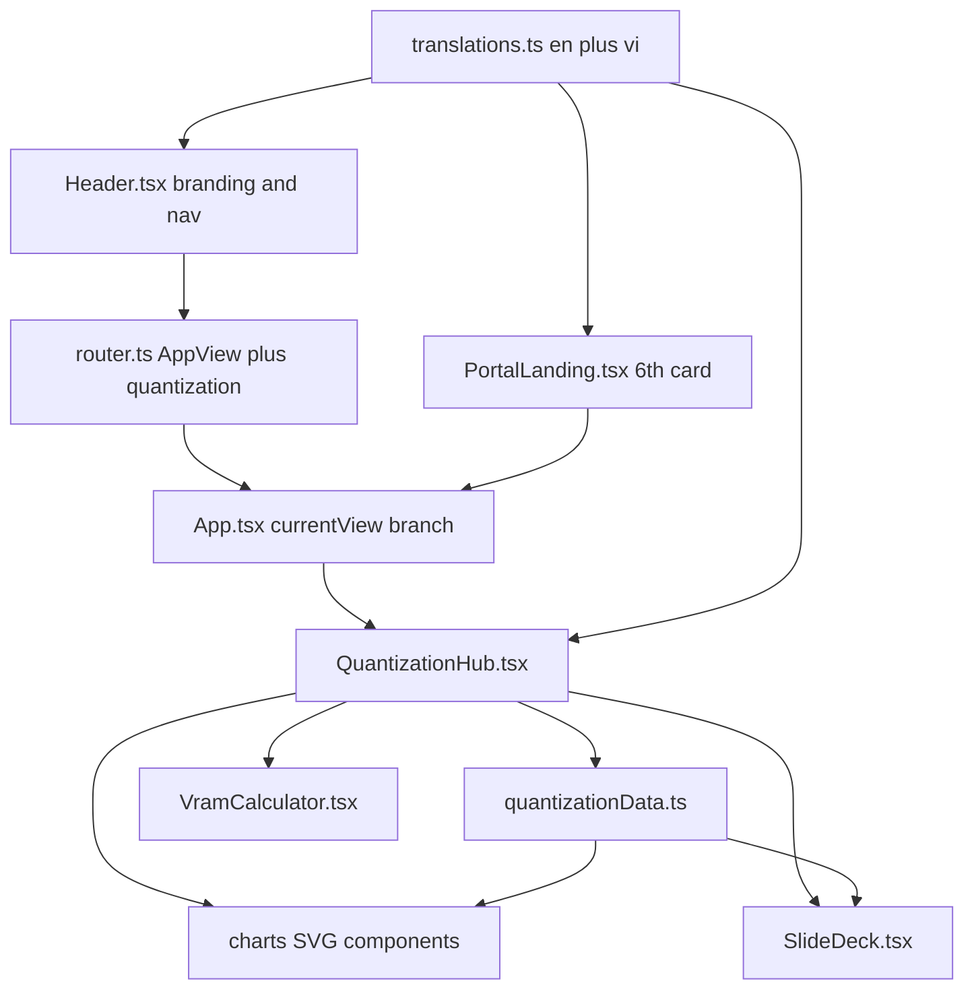

# Plan: Port the LLM Quantization Deck into the React Hub

## Objective
Integrate the content of [`references_doc/quantization/presentation_script.md`](references_doc/quantization/presentation_script.md), [`references_doc/quantization/quantization_visuals.md`](references_doc/quantization/quantization_visuals.md), and [`references_doc/quantization/presentation.html`](references_doc/quantization/presentation.html) into the existing React SPA as a first-class "AI Quantization" hub view, matching the established patterns of the other five hubs.

## Constraints and Decisions
- **No new dependencies.** Charts are hand-built with inline SVG, Tailwind, and CSS. `chart.js` from the reference page is dropped. Font Awesome icons are replaced with `lucide-react`.
- **Follow the AIPatterns precedent.** [`src/components/AIPatterns.tsx`](src/components/AIPatterns.tsx:1) is the reference for porting a standalone `presentation.html` into a React hub component.
- **Bilingual.** All user-facing strings go through [`src/data/translations.ts`](src/data/translations.ts:1) with `en` and `vi` keys.
- **Dark deck theme.** The quantization hub uses its own dark surface styling (slate-950 background, glass cards, glow accents) scoped inside the view, since the app shell is light-themed.

## Architecture



## Reference-to-Component Mapping

| Reference source | Target component | Notes |
| :--- | :--- | :--- |
| Slides 1-2, Trilemma | [`QuantizationHub.tsx`](src/components/quantization/QuantizationHub.tsx:1) section `overview` | 3 pillar cards plus effective-bpw pipeline and granularity table |
| Slide 3, B2 table | `foundations` section plus EmpiricalDualAxis chart | 10-tier empirical dataset |
| Slides 4-5 | `strategy` section | PTQ vs PE-QAT vs QAT cards plus 3 calibration traps |
| Slides 6-8 | `algorithms` section plus GptqAwqBars | LLM.int8, QLoRA, GPTQ, AWQ, SmoothQuant, QuaRot |
| Slide 9 | `formats` section plus FormatThroughput | FP8, OCP MX, NVFP4 cards |
| Slides 10-12 | `production` section plus VramCalculator | DeepSeek FP8, KV cache trap, MLX vs GGUF |
| Slide 13 | `decision-framework` section | Interactive decision tree plus 5 rules |
| Backup B1-B2 | `backup` section | Repos, toolkits, hardware matrix |
| All slides | `SlideDeck.tsx` | 15-slide fullscreen modal with speaker notes |
| Mermaid diagrams 1-17 | `charts/` SVG components | Rendered as styled flow visuals instead of Mermaid |

## File Layout

```text
src/
  data/
    quantizationData.ts
  components/
    quantization/
      QuantizationHub.tsx
      SlideDeck.tsx
      VramCalculator.tsx
      charts/
        ModelFootprintBar.tsx
        TrilemmaRadar.tsx
        EmpiricalDualAxis.tsx
        GptqAwqBars.tsx
        FormatThroughput.tsx
        index.ts
```

## Wiring Changes
- [`src/utils/router.ts`](src/utils/router.ts:5): add `'quantization'` to `AppView`, add path matching for `/ai_quantization`, `/quantization`, `/quant`, and add the `getViewPath` case.
- [`src/App.tsx`](src/App.tsx:13): import `QuantizationHub`, add the `currentView === 'quantization'` branch, and add the footer text line.
- [`src/components/Header.tsx`](src/components/Header.tsx:6): extend `HeaderView`, add quantization branding and nav items, and route the new nav target.
- [`src/components/PortalLanding.tsx`](src/components/PortalLanding.tsx:6): add the 6th card and widen the `onSelectTopic` union.
- [`src/components/PortalLanding.tsx`](src/components/PortalLanding.tsx:270): update hub/playbook counters.
- [`src/index.css`](src/index.css:1): add dark deck utility classes and glass/glow tokens.
- `index.html`: add the Inter and JetBrains Mono font links.

## Verification
- `npm run lint` via oxlint.
- `npm run build` via `tsc -b && vite build`.
- Manual check of the new route, the 6 portal cards, the 15-slide deck keyboard controls, and the VRAM calculator reactivity.