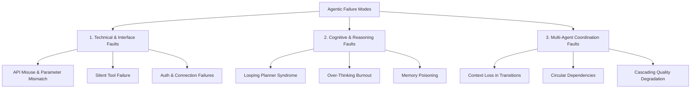
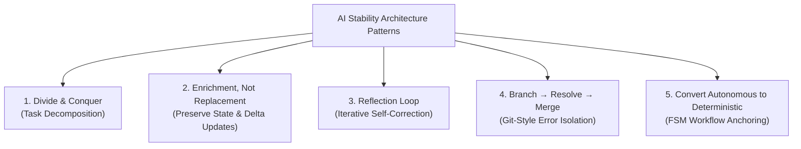

# Agentic AI System Engineering & Debugging Guide
> **Framework Độ Tin Cậy & Quan Sát Hệ Thống AI Xác Suất (Probabilistic AI Reliability Engineering)**  
> *Phiên bản: v2026.4.1-STABLE*

---

## 📌 Tổng Quan (Executive Summary)

Trong kỹ nghệ phần mềm truyền thống, việc kiểm thử và sửa lỗi dựa trên nền tảng **deterministic** (xác định: cùng đầu vào luôn cho cùng một đầu ra, lỗi phát sinh đi kèm stack trace rõ ràng). Tuy nhiên, khi chuyển dịch sang **Agentic AI** với khả năng tự lập kế hoạch (*autonomous planning*) và sử dụng công cụ nhiều bước (*multi-step tool use*) trong các tác vụ dài hạn (*long-horizon tasks*), chúng ta phải đối mặt với **hệ thống xác suất (probabilistic systems)**.

Chuyển đổi cốt lõi:
- **Từ:** Deterministic Software Testing & Error Exception Handling.
- **Sang:** Probabilistic Reliability Frameworks, High-Fidelity Execution Graph Tracing, và Deterministic Workflow Anchoring.

```
Deterministic World:      Code A ────────▶ Code B ────────▶ Predictable Output (Exception / Stack trace)
Probabilistic Agents:     Prompt ───(p)──▶ Reasoning ──(p)──▶ Tool Call ──(p)──▶ Cumulative Error Decay
```

---

## ⚡ Hai Cuộc Khủng Hoảng Nền Tảng (Core Challenges)

### 1. The Reliability Crisis & The Multiplication Effect
Trong một chuỗi tác vụ dài gồm $k$ bước thực thi độc lập, nếu mỗi bước có xác suất thành công là $p$, thì xác suất thành công toàn chuỗi suy giảm theo quy luật hàm mũ:

$$\text{pass}^k = p^k$$

*Ví dụ thực tế:*
- Nếu một mô hình đơn lẻ có độ chính xác từng bước rất cao $p = 90\%$ ($0.9$):
  - Qua $5$ bước: $0.9^5 \approx 59\%$
  - Qua $8$ bước: $0.9^8 \approx 43\%$
- Nếu một lần chạy đơn lẻ đạt $80\%$ ($p = 0.8$):
  - Qua $8$ bước ($k = 8$), tỷ lệ thành công sụt giảm nghiêm trọng xuống còn **$0.8^8 \approx 16.7\%$**.

> [!WARNING]
> Một sai số nhỏ chỉ $1\%$ tại một bước trung gian sẽ được nhân lũy kế qua long-horizon tasks, tạo ra **"Multiplication Effect"** làm suy sụp độ ổn định của toàn bộ chuỗi thực thi nghiệp vụ.

### 2. Non-deterministic Models & Reasoning Divergence
Khác với việc bắt Exception cú pháp (syntax error) trong code, các mô hình xác suất thường không ném lỗi crash. Thay vào đó, mô hình lặng lẽ "rẽ nhánh" khỏi quỹ đạo tối ưu (*reasoning trajectory divergence*). Hệ thống đòi hỏi chiến lược quan sát để **Localization** (khoanh vùng chính xác điểm phân kỳ) thay vì chỉ nhìn vào kết quả cuối cùng.

---

## 1. Các Dạng Lỗi Thường Gặp (Common Failure Modes)

Lỗi trong hệ thống Agent được phân rã thành ba danh mục cốt lõi:



### 1. Technical & Interface Faults (Lỗi Kỹ thuật & Giao diện Tương tác)
* **API Misuse & Parameter Mismatch**:
  - Vi phạm hợp đồng kỹ thuật (technical contract) của công cụ.
  - Gọi unsupported endpoints, sai kiểu dữ liệu, hoặc gửi `null` values thay vì structured schema mong đợi.
* **Silent Tool Failure**:
  - Công cụ ngoại vi trả về HTTP error code hoặc chuỗi rỗng (`""`), nhưng Agent lờ đi và tiếp tục suy luận dựa trên dữ liệu ảo giác (*hallucinated data*).
* **Auth & Connection Failures**:
  - Lỗi cấu hình tĩnh (base URL sai, API Key hết hạn, thiếu quyền truy cập VPC, thiết bị phần cứng hoặc network sandbox).

### 2. Cognitive & Reasoning Faults (Lỗi Nhận thức & Chuỗi Lý luận)
* **Looping Planner Syndrome**:
  - Agent lặp lại cùng một chuỗi hành động mà không tạo ra bước tiến triển nào do thất bại trong việc cập nhật state nội bộ từ phản hồi của môi trường.
* **Over-Thinking Burnout**:
  - Agent rơi vào chu trình suy luận vô tận (*infinite reasoning loop*), tiêu tốn hàng trăm ngàn token và đẩy độ trễ (latency) lên cao mà không đưa ra được quyết định hành động cuối cùng.
* **Memory Poisoning**:
  - Dữ liệu sai lệch hoặc ảo giác được ghi trực tiếp vào Long-Term Memory (vector database, memory store), làm ô nhiễm toàn bộ các phiên truy xuất (retrieval sessions) trong tương lai.

### 3. Multi-Agent Coordination Faults (Lỗi Điều phối Đa Agent)
* **Context Loss in Transitions (Thất thoát Ngữ cảnh)**:
  - Thông tin trọng yếu bị đánh mất hoặc tóm tắt quá mức trong quá trình bàn giao (*handoff*) giữa các Agent, biến đầu vào chất lượng thành đầu ra kém chất lượng.
* **Circular Dependencies (Phụ thuộc Vòng lặp)**:
  - Agent A ủy quyền nhiệm vụ cho Agent B, Agent B trong quá trình suy luận lại ủy thác ngược lại cho Agent A, dẫn tới cạn kiệt tài nguyên tính toán và token budget.
* **Cascading Quality Degradation (Suy thoái Chất lượng Thác đổ)**:
  - Một sai số nhỏ từ Agent upstream bị khuếch đại lũy kế qua từng Agent kế tiếp cho đến khi kết quả cuối cùng bị suy thoái hoàn toàn.

---

## 2. Ngăn Xếp Giám Sát & Truy Vết (Observability Stack)

Giám sát request/response truyền thống theo kiểu HTTP log là **hoàn toàn không đủ**. Hệ thống Agent bắt buộc phải có **High-Fidelity Tracing** của toàn bộ đồ thị thực thi (*execution graph*): từng bước suy nghĩ (thought), hành động (action), phản hồi công cụ (observation), và biến đổi trạng thái (state transition).

### Bảng So Sánh Các Công Cụ Observability Hàng Đầu

| Nền tảng | Thế mạnh Cốt lõi (Core Strength) | Tính năng Gỡ lỗi Nổi bật (Unique Debugging Feature) | Ghi chú Tích hợp |
| :--- | :--- | :--- | :--- |
| **MLflow** | **Unified Platform** | One-line `autolog` hỗ trợ hơn 50+ framework; tự động phản chiếu (mirror) traces từ Langfuse. | Hỗ trợ Framework-agnostic Python SDK, giúp giám sát tập trung mà không phá vỡ hạ tầng observability sẵn có. |
| **Langfuse** | **Self-Hosting & Privacy** | Lựa chọn mặc định mã nguồn mở cho dữ liệu bảo mật; deep step-level tracing với chi phí tối ưu. | Cung cấp UI chi tiết cho từng token, latency breakdown, và trace visualizer. |
| **LangSmith** | **Fidelity & Scaling** | Tính năng **Insights** gom cụm traces thành các danh mục lỗi (failure categories) bằng phân tích LLM tự động. | Hệ sinh thái hoàn chỉnh với LangChain/LangGraph, hỗ trợ dataset curation trực tiếp từ production trace. |

---

## 3. Phương Pháp Luận Gỡ Lỗi (Debugging Methodologies)

Gỡ lỗi Agent không phải là bắt exception cú pháp, mà là **định vị điểm rẽ nhánh (divergence point)** trong không gian lý luận xác suất.

```
Optimal Path:    [Plan] ──▶ [Tool Call: Search] ──▶ [Valid Result] ──▶ [Synthesize] ✅
                                    │
Divergence Point:                   └──▶ [Hallucinated Query] ──▶ [Empty Result] ──▶ [Looping / Hallucination] ❌
```

Bốn phương pháp luận cốt lõi:

1. **Time-Travel Debugging (Agent Rollout - State Rollback)**:
   - Cho phép quay ngược (*rewind*) phiên chạy bị lỗi về một span hoặc checkpoint cụ thể trong quá khứ.
   - Kỹ sư có thể tinh chỉnh prompt, cập nhật tool description, hoặc đổi model, sau đó kích hoạt thực thi mới (*rollout*) từ điểm đó để kiểm thử bản vá ngay tức khắc mà không cần chạy lại từ đầu.
2. **Agent Interaction Graph Analysis (Graph Theory)**:
   - Trực quan hóa các tương tác giữa các Agent dưới dạng đồ thị có hướng (*directed graph*).
   - Dùng thuật toán đồ thị để phát hiện chu trình lặp (*cycles*), các nút thắt cổ chai (*bottlenecks*), hoặc các subgraph bị cô lập (*deadlock/orphaned branches*).
3. **Manual Transcript Review (Quality Audit)**:
   - Đọc duyệt có hệ thống các bản ghi hội thoại và suy luận (*transcripts*) để phân biệt rõ: lỗi do năng lực mô hình hay do bộ tiêu chuẩn đánh giá (*Evaluation Harness*)/yêu cầu đề bài (*task specification*) bị mơ hồ.
4. **Simulation for Reproduction (Sandbox Replay)**:
   - Trích xuất các tình huống lỗi thực tế (failure scenarios) thành bộ template chuẩn hóa.
   - Tái hiện chính xác chuỗi sự kiện trong môi trường sandbox được cô lập và kiểm soát nhằm phục vụ regression testing.

---

## 4. Các Mẫu Kiến Trúc Tăng Cường Độ Ổn Định & Độ Chính Xác (Stability & Accuracy Patterns)

> [!TIP]
> Chi tiết kiến trúc, biểu đồ tương tác và sandbox mô phỏng chuyên sâu được trình bày tại:  
> 🔗 **[Mini Patterns for Stable AI Workflows: Architectural Guide](file:///Users/tinhluong/work_dir/research_prjs/ai_governance_practices/references_doc/mini_pattern_for_AI/README.md)**

Để chế ngự tính bất định của các mô hình xác suất và ngăn chặn sự suy thoái $\text{pass}^k = p^k$, hệ thống Agentic áp dụng bộ **Mini Patterns** cốt lõi kết hợp cùng cơ chế điều phối xác định:



### Pattern 01: Task Decomposition / Divide & Conquer (Chia Để Trị)
- **Cơ chế**: Sử dụng **Hierarchical Task Forests** để phân giải một câu truy vấn lớn, đa chiều thành các nhánh nhiệm vụ con độc lập, chạy song song. Điều này giúp loại bỏ hiện tượng "nghẽn ngữ cảnh" (*context window saturation*).
- **Causal Partitioning**: Gom cụm các biến có quan hệ nhân quả mạch lạc vào từng luồng con xử lý độc lập trước khi hợp nhất (*synthesize*) về kết quả chung.
- *Xem chi tiết tại:* [Mini Pattern 01: Divide & Conquer](file:///Users/tinhluong/work_dir/research_prjs/ai_governance_practices/references_doc/mini_pattern_for_AI/README.md#1-pattern-01-divide--conquer-chia-%C4%91%E1%BB%83-tr%E1%BB%8B)

```
                      ┌──────────────────────────────────────┐
                      │ User Query (High-dimensional Task)   │
                      └──────────────────┬───────────────────┘
                                         │
                    ┌────────────────────┴────────────────────┐
                    ▼                                         ▼
   ┌─────────────────────────────────┐       ┌─────────────────────────────────┐
   │ Branch α: Data Extraction       │       │ Branch β: Domain-Specific       │
   │ & Schema Validation             │       │ Verification                    │
   └────────────────┬────────────────┘       └────────────────┬────────────────┘
                    │                                         │
                    └────────────────────┬────────────────────┘
                                         ▼
                      ┌──────────────────────────────────────┐
                      │ Consolidated Output (Synthesized)    │
                      └──────────────────────────────────────┘
```

### Pattern 02: Enrichment, Not Replacement (Bổ Sung, Không Viết Lại Từ Đầu)
- **Cơ chế**: Thay vì yêu cầu LLM viết lại toàn bộ một tài liệu hay schema phức tạp mỗi khi có dữ liệu mới (dễ gây mất kiểm soát và ảo giác), hệ thống khóa cứng (*freeze*) trạng thái đã kiểm định và chỉ áp dụng **Delta Updates** từ ngữ cảnh mới.
- **Giá trị**: Bảo tồn 100% các dữ liệu đã xác thực, giảm đáng kể latency và token consumption.
- *Xem chi tiết tại:* [Mini Pattern 02: Enrichment, Not Replacement](file:///Users/tinhluong/work_dir/research_prjs/ai_governance_practices/references_doc/mini_pattern_for_AI/README.md#2-pattern-02-enrichment-not-replacement-b%E1%BB%95-sung-kh%C3%B4ng-thay-th%E1%BA%BF)

### Pattern 03: Iterative Self-Correction & Reflection Loop (Vòng Lặp Phản Biện)
- **Cơ chế**: Tách riêng persona người thực thi (**Generator**) và người phản biện (**Critic**).
- **Rubric Audit**: Thay vì đưa ra câu hỏi định tính chung chung (e.g. *"Hãy kiểm tra lại xem có đúng không"*), persona Critic bắt buộc phải đối soát dựa trên một bảng tiêu chí (*strict rubric*) cụ thể (kiểm tra schema JSON, kiểm tra tính toán toán học, kiểm tra trích dẫn tài liệu).
- **Loop Cap Guardrail**: Luôn áp đặt trần giới hạn tối đa **3–5 vòng lặp**. Nếu sau số lần này vẫn không đạt tiêu chuẩn rubric, chuyển hướng sang fallback hoặc escalate cho người vận hành, nhằm triệt tiêu hoàn toàn nguy cơ **Over-Thinking Burnout**.
- *Xem chi tiết tại:* [Mini Pattern 03: Reflection Loop](file:///Users/tinhluong/work_dir/research_prjs/ai_governance_practices/references_doc/mini_pattern_for_AI/README.md#3-pattern-03-reflection-loop-v%C3%B2ng-l%E1%BA%B7p-ph%E1%BA%A3n-bi%E1%BB%87n--t%E1%BB%B1-hi%E1%BB%87u-ch%E1%BB%89nh)

```
  ┌────────────────────────────────────────────────────────┐
  │                                                        │
  ▼                                                        │
[ Step 1: GENERATE ]  ──▶  [ Step 2: REFLECT (CRITIC) ] ───┘ (if failed rubric, max 3-5 loops)
   Draft Output                 Rubric Audit
                                     │ (passed)
                                     ▼
                           [ Step 3: REFINE ]
                             Final Verified Output
```

### Pattern 04: Branch $\rightarrow$ Resolve $\rightarrow$ Merge (Phân Nhánh & Cách Ly Lỗi Kiểu Git)
- **Cơ chế**: Khi gặp tác vụ con chưa chắc chắn hoặc cần thực hiện quy trình gỡ lỗi nhiều bước, hệ thống không làm treo luồng chính mà fork ra một **sub-agent branch**.
- **Giá trị**: Cho phép sub-agent thử nghiệm trong sandbox cô lập; chỉ khi kết quả được kiểm định mới merge về luồng chính, ngăn ngừa triệt để lỗi **Memory Poisoning**.
- *Xem chi tiết tại:* [Mini Pattern 04: Branch → Resolve → Merge](file:///Users/tinhluong/work_dir/research_prjs/ai_governance_practices/references_doc/mini_pattern_for_AI/README.md#4-pattern-04-branch-%E2%86%92-resolve-%E2%86%92-merge-ph%C3%A2n-nh%C3%A1nh-%E2%86%92-gi%E1%BA%A3i-quy%E1%BA%BFt-%E2%86%92-h%E1%BB%A3p-nh%E1%BA%A5t)

### Pattern 05: Convert Autonomous to Deterministic (Chuyển Hóa Tự Do Thành Xác Định)
- **Triết lý**: Thay vì cho phép LLM tự do quyết định luồng đi ở mọi bước, hãy chuyển hóa luồng xác suất thành **State Machine (FSM)** xác định. Mã nguồn (code logic) sẽ đóng vai trò neo giữ trạng thái; LLM chỉ thực thi logic bên trong từng node.
- **Workflow Anchoring**: Đặt ra các cổng kiểm soát (*checkpoints*) bắt buộc bằng code mà Agent không thể tự ý nhảy cóc.
- **Finite State Machines (FSM)**: Ràng buộc hành vi chuyển tiếp trạng thái bằng rule-based code thay vì để LLM tự phán đoán hướng đi tiếp theo.

```
Unconstrained Autonomous (Risky):
[Start] ──(LLM decides)──▶ [Any Tool / Action?] ──(LLM decides)──▶ [High Variance / Error]

Deterministic FSM Gate (Reliable):
[State A] ──▶ [Deterministic Gate / Validator (Code)] ──▶ [State B] ──▶ [100% Reliable Transition]
```

---

## 5. Quản Trị & Rào Chắn Vận Hành (Governance & Strategic Add-ons)

Hạ tầng quản trị đảm bảo hệ thống Agent vận hành an toàn trong giới hạn ngân sách và rủi ro cho phép:

```
┌─────────────────────────────────────────────────────────────────────────────┐
│                             GOVERNANCE STACK                                │
├─────────────────────────┬─────────────────────────┬─────────────────────────┤
│ 1. Resource Config      │ 2. Active Guardrails    │ 3. Strategic Arch       │
│ • Max Tokens Bound      │ • Hard Stops            │ • Policy-Tool Separation│
│ • Financial Caps        │ • Authority Manifolds   │ • Strategic HITL        │
└─────────────────────────┴─────────────────────────┴─────────────────────────┘
```

### 1. Resource Configuration (Cấu hình Tài nguyên)
* **Max Tokens Bound**:
  - Thiết lập trần context window cố định và giới hạn token output sinh ra trên mỗi lượt gọi để ngăn chặn các vòng lặp token bất tận.
* **Financial Caps**:
  - Đặt ngưỡng ngân sách cứng (hard dollar limit) cho từng task/session.
  - Tự động chuyển đổi sang chế độ fallback hoặc ngắt tiến trình khi chi phí vượt ngưỡng trần.

### 2. Active Guardrails (Rào Chắn Chủ Động)
* **Hard Stops & Rate Limits**:
  - Tự động ngắt kết nối khi tần suất gọi API hoặc công cụ vượt ngưỡng an toàn trong một khoảng thời gian ngắn, hoặc khi phát hiện tín hiệu hành vi nguy hại.
* **Authority Manifolds (Ranh Giới Quyền Hạn)**:
  - Ràng buộc quyền hạn theo thời gian và ngữ cảnh tác vụ (*temporal constraints*). Không bao giờ cấp quyền vĩnh viễn hoặc quyền quản trị không giới hạn cho Agent.

### 3. Strategic Architecture (Kiến Trúc Chiến Lược)
* **Policy-Tool Separation (Tách biệt Lớp Chính sách & Công cụ)**:
  - Phân tách rõ ràng giữa **Policy Layer** (đánh giá rủi ro, kiểm duyệt prompt, kiểm tra ngân sách) và **Tool Layer** (thực thi theo nguyên tắc đặc quyền tối thiểu - *Least Privilege*).
* **Strategic Human-In-The-Loop (HITL)**:
  - Bắt buộc kích hoạt sự phê duyệt của con người đối với các hành động rủi ro cao (ghi dữ liệu, xóa cơ sở dữ liệu, chuyển tiền, gửi email diện rộng).
  - Tự động chuyển giao quyền quyết định cho con người khi điểm tin cậy của mô hình (*model confidence*) giảm xuống dưới **85%**.

---

## 🔗 Liên kết & Tài liệu Tham khảo
- [Mini Patterns for Stable AI Workflows](file:///Users/tinhluong/work_dir/research_prjs/ai_governance_practices/references_doc/mini_pattern_for_AI/README.md)
- [Agentic Types Reference Guide: LLM Call vs. Workflow vs. Autonomous Agent](file:///Users/tinhluong/work_dir/research_prjs/ai_governance_practices/references_doc/agentic_types/README.md)
- [AI Optimization & Governance Practices](file:///Users/tinhluong/work_dir/research_prjs/ai_governance_practices/references_doc/optimization.md)

