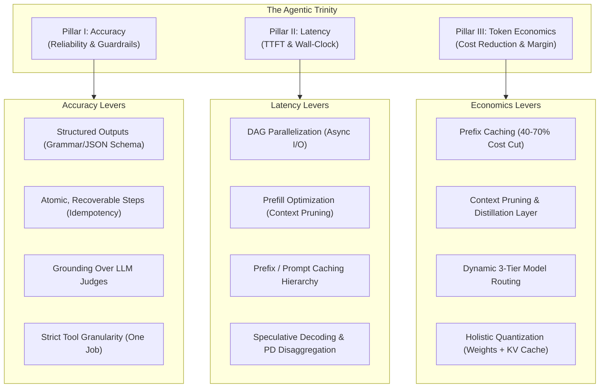

# Mastering the Agentic Trinity: Accuracy, Latency, and Token Economics

> **AI Optimization & Efficiency Engineering Hub**  
> *Repository Architectural Blueprint & Production Optimization Guide*  
> *Reference Implementation: [AIOptimization.tsx](file:///Users/tinhluong/work_dir/research_prjs/ai_governance_practices/src/components/AIOptimization.tsx)*

---

## 📌 Executive Summary & Architectural Premise

Most failures in enterprise AI agents and generative pipelines are **systems failures**, not model failures. Teams frequently blame foundational model capabilities or attempt unguided prompt engineering when the true root cause lies in the unmanaged tension across three competing forces: **Accuracy**, **Latency**, and **Token Economics**.

```
                           ▲
                          / \
                         /   \
                        /     \
       PILLAR I:       /       \       PILLAR II:
       ACCURACY       /         \       LATENCY
  (Prevent Cascading) ─────────── (Wall-Clock / TTFT)
           \                           /
            \                         /
             \                       /
              \                     /
               ▼                   ▼
                   PILLAR III:
                 TOKEN ECONOMICS
               (Compounding Costs)
```

Without deliberate architecture:
- Improving **Accuracy** via multi-agent debate, reflexivity, and exhaustive RAG context causes **Latency** to explode and **Token Costs** to scale exponentially (up to a hidden 30× multiplier).
- Optimizing for **Latency** by stripping context or skipping validation leads to hallucinations and catastrophic workflow cascading failures.
- Slashing **Token Costs** through aggressive truncation degrades reasoning fidelity and tool schema compliance.

This guide captures the **current state of AI optimization** codified within this repository, spanning application-level API patterns to bare-metal self-hosted GPU inference.

---

## 🏷️ Applicability Tiers

Every optimization technique in this repository is categorized into an **applicability tier** based on operational footprint:

| Tier | Icon | Scope & Infrastructure Requirements |
|:-----|:----:|:-----------------------------------|
| **API** | 🟢 | Works with any commercial LLM API (OpenAI, Anthropic Claude, Google Gemini, Mistral) — zero custom infrastructure required. |
| **Self-Hosted** | 🟡 | Requires running dedicated inference engines (vLLM, Ollama, Hugging Face TGI, SGLang, TensorRT-LLM). |
| **Infra** | 🔴 | Requires cluster-level orchestration, custom serving stacks, network topology control, or GPU fleet management. |

---

## 🏛️ The Three Pillars of Agentic Optimization



---

## 🎯 Pillar I: Accuracy — Preventing Cascading Failures & Out-of-Bound Generation

*Goal: Ensure deterministic output validity and guarantee that an upstream error cannot snowball into an irrecoverable multi-step failure.*

### 1. Structured Output Modes, Not Post-Hoc Parsing 🟢 🟡
* **The Antipattern**: Instructing an LLM to "return valid JSON" and attempting regex extraction or `JSON.parse()` in post-processing. A single rogue punctuation mark or conversational preamble causes parse errors, retries, and high latency.
* **The Production Fix (API 🟢)**: Enforce native schema constraints at token generation time (OpenAI `response_format: { type: "json_schema" }`, Anthropic tool-use schema, Gemini `response_schema`). The model physically emits only tokens that conform to the target JSON schema, eliminating explanatory filler and parse errors.
* **The Self-Hosted Fix (Self-Hosted 🟡)**: Use grammar-constrained sampling at the logit-processing head (e.g., via Outlines, Guidance, or vLLM guided decoding using Finite-State Automata / FSA). Invalid tokens are masked out before softmax sampling with zero accuracy penalty.

### 2. Design Atomic, Recoverable Agent Steps 🟢
* **The Antipattern**: Chaining multiple reasoning steps into a monolith where step $N$ blindly consumes the text of step $N-1$. When a hallucination occurs, all downstream steps amplify the corruption.
* **The Production Fix**:
  1. **State Serialization**: Checkpoint full session state, tool payload history, and variables to a persistent store (e.g., Redis / Postgres) before executing any agent transition.
  2. **Failure Classification**:
     - *Transient Failures* (network timeout, rate limits, 5xx server errors): Retry with exponential backoff and randomized jitter.
     - *Semantic Failures* (schema mismatch, business constraint violation): **Never retry identical context.** Roll back to the last known healthy state, inject the specific validation error into the repair prompt, or route to a fallback handler.
  3. **Idempotency Keys**: Enforce unique UUID idempotency keys on all external mutating tool calls (e.g., payment transactions, database writes, external notifications) to ensure retries do not cause duplicate side effects.

### 3. Grounding Over LLM Judges 🟢
* **The Antipattern**: Relying exclusively on high-parameter LLM-as-a-judge calls to evaluate outputs. Evaluator models introduce their own variance, latency overhead, and 2×–3× cost inflation.
* **Tiered Evaluation Matrix**:

| Evaluation Approach | Cost Tier | Latency | When to Deploy |
|:-------------------|:---------:|:-------:|:---------------|
| **Schema & Business Rule Checks** | ~$0 | < 1 ms | **First Line of Defense**: Structural bounds, required keys, regex patterns, numeric ranges. |
| **Embedding Vector Similarity** | Very Low | ~15–30 ms | **RAG Pipelines**: Verifying semantic proximity between generated responses and retrieved chunks to detect drift. |
| **Algorithmic Self-Consistency** | 3–5× Single Call | Medium | **High-Stakes Numeric / Logic**: Sample 3–5 responses at $T \approx 0.7$, compute semantic consensus or edit distance spread; discard outliers. |
| **LLM-as-a-Judge API** | High | High | **Subjective Quality Only**: Nuanced tone, brand alignment, or open-ended legal compliance where deterministic rules cannot be formulated. |

### 4. Control Tool Granularity 🟢
* **The Antipattern**: Constructing "Swiss Army knife" tools with dozens of optional boolean flags (e.g., `fetch_user_data(include_orders=True, include_billing=True, include_logs=True)`).
* **Core Rules**:
  - **One Tool, One Job**: Split bloated tools into clean, single-purpose functions with non-overlapping descriptions.
  - **Explicit Error Payloads**: Tools must return structured JSON error payloads (e.g., `{"status": "error", "code": "RESOURCE_NOT_FOUND", "retryable": false}`) rather than raising unhandled exceptions or returning silent empty strings.
  - **Dynamic Tool Masking**: Only expose tools relevant to the current stage of the execution graph. Feeding 50 tool definitions simultaneously dilutes attention and spikes hallucinated tool calls.

---

## ⚡ Pillar II: Latency — Breaking the 1-Second Barrier

*Goal: Minimize Time-to-First-Token (TTFT) and total wall-clock execution time across multi-step execution graphs.*

### 1. Parallelize Independent Work (DAG Orchestration) 🟢
* **The Antipattern**: Executing independent retrieval, web search, or database queries in a strict sequential blocking loop.
* **The Production Fix**: Model the agent workflow as a Directed Acyclic Graph (DAG). Execute non-dependent branches concurrently using non-blocking async operations (`asyncio.gather()` in Python, `Promise.all()` in TypeScript).
* **Impact**: Parallelizing independent RAG retrievals and tool queries delivers a **1.6×–1.8× reduction in end-to-end wall-clock latency** without altering model weights.

### 2. Prefill Optimization (Context Pruning) 🟢
* **The Antipattern**: Dumping the top-10 or top-20 raw RAG vector chunks directly into the prompt prefill window.
* **The Production Fix**:
  - **Top-K Distillation**: Retrieve candidate chunks broadly, then pass them through a lightweight cross-encoder re-ranker (e.g., BGE-Reranker, Cohere Rerank) and retain only the top 3–4 high-density passages.
  - **System Prompt Compression**: Eliminate conversational fluff and redundant instructions. A tight, declarative prompt performs better and consumes 60–70% fewer prefill tokens.
  - **Rolling Conversation Summaries**: For multi-turn dialogs, compress older turns into a consolidated factual summary state rather than carrying an unbounded raw message history.

### 3. Prefix / Prompt Caching Architecture 🟢
* **The Antipattern**: Placing dynamic session data, timestamps, or transient user queries at the beginning of the prompt payload, invalidating the key-value (KV) cache on every request.
* **The Production Fix**: Strictly enforce a hierarchical prompt layout:
  1. **Tier 1 (Top)**: Static system instructions & governance guardrails *(Fully Cacheable)*
  2. **Tier 2 (Middle)**: Static tool definitions & persistent reference documents *(Fully Cacheable)*
  3. **Tier 3 (Bottom)**: Dynamic user prompt, conversation history, and ephemeral session inputs *(Non-Cacheable)*
* **Provider Implementations**:
  - *OpenAI*: Automatic prefix caching for prompts exceeding 1,024 tokens.
  - *Anthropic Claude*: Explicit `cache_control: {"type": "ephemeral"}` breakpoints.
  - *Google Gemini*: Explicit `cachedContent` context caching for large knowledge corpora.
* **Sticky Routing**: Direct returning users to the same inference node (session affinity) to maximize local GPU KV cache hit rates.

### 4. Speculative Decoding & Serving Optimization 🟡 🔴
* **Speculative Decoding (🟡)**: A smaller, high-speed draft model (e.g., 1B–3B parameters) speculatively generates $K$ tokens ahead, and the primary target model (e.g., 70B parameters) verifies all tokens in a single forward pass.
  - **Throughput Gain**: **2.5×–3.2× speedup** with zero degradation in mathematical output fidelity.
  - **Dynamic Draft Adapter**: Shorten draft horizon when acceptance rates fall below 60%; lengthen when acceptance rates exceed 90%.
* **Prefill-Decode (PD) Disaggregation (🔴)**: The prefill phase is compute-bound (matrix multiplication), whereas the decode phase is memory-bandwidth-bound (autoregressive memory transfer). Co-locating both on the same GPU creates catastrophic interference that degrades p95/p99 tail latencies. Disaggregate prefill and decode workloads across dedicated GPU pools to slash tail latency by **5×–10×**.
* **Paged KV Cache Memory Architecture (🟡)**: Allocate KV cache memory in non-contiguous virtual pages (e.g., vLLM PagedAttention) to eliminate external VRAM fragmentation, unlocking **2×–4× larger batch capacities**.

---

## 💰 Pillar III: Token Economics — Crushing the Compounding Cost Crisis

*Goal: Tame the hidden 30× cost multiplier of agentic loops and sustain viable unit margins in production.*

### 1. The 3-Tier Dynamic Model Routing Pattern 🟢
Deploying frontier reasoning models (e.g., Claude 3.5 Sonnet, GPT-4o, Gemini 1.5 Pro) for routine, low-entropy extraction or classification is cost-prohibitive.

```
                              User Query
                                  │
                                  ▼
                     ┌─────────────────────────┐
                     │   Task Router / Class   │
                     └────────────┬────────────┘
                                  │
         ┌────────────────────────┼────────────────────────┐
         │ (High Complexity)      │ (Nuanced Synthesis)    │ (Repetitive / Extract)
         ▼                        ▼                        ▼
┌─────────────────┐      ┌─────────────────┐      ┌─────────────────┐
│  Tier 1: High   │      │  Tier 2: Mid    │      │  Tier 3: Low    │
│  Frontier /     │      │  Balanced       │      │  Small / Fast   │
│  Orchestrator   │      │  Reasoning      │      │  Extractive     │
│  (GPT-4o,       │      │  (Claude Haiku, │      │  (Llama-3-8B,   │
│   Claude Sonnet)│      │   GPT-4o-mini)  │      │   Gemini Flash) │
└────────┬────────┘      └────────┬────────┘      └────────┬────────┘
         │                        │                        │
         └────────────────────────┼────────────────────────┘
                                  ▼
                      Validated Response Output
```

| Model Tier | Typical Frequency | Target Workloads | Economic Impact |
|:-----------|:-----------------:|:-----------------|:----------------|
| **Tier 1: Frontier / Orchestrator** | 1–2 calls per workflow | Global task planning, ambiguity resolution, critical synthesis, unrecoverable edge cases. | High cost per call, but low volume; eliminates expensive global rework. |
| **Tier 2: Mid-Range / Balanced** | 3–10 calls per workflow | Step critique, structured drafting, domain validation. | Moderate cost; balances nuance against high throughput. |
| **Tier 3: Lightweight / Fast** | 30–50 calls per workflow | Named entity extraction, schema mapping, intent routing, search query expansion. | **Cuts 40%–70% of total pipeline token expenditure.** |

* **Entropy-Based Escalation**: Measure token entropy or softmax confidence distribution on lightweight model responses. If variance exceeds an uncertainty threshold, automatically escalate execution to the Tier 1 model.

### 2. Context Pruning & Output Budgeting 🟢
* **Strict Output Budgeting**: Explicit instructions such as `"Provide output strictly as valid JSON with zero conversational preamble"` or `"Summarize in at most 3 concise bullet points"` immediately decrease output token consumption by 30%–60%.
* **Selective Context Distillation**: Strip raw HTML, markdown noise, and boilerplate headers before feeding retrieved context into model prompts.

### 3. Holistic Quantization Strategy 🟡 🔴
When self-hosting inference models, quantize both model weights and KV memory:
* **Weight Quantization (AWQ / GPTQ - 4-bit / 8-bit)**: Reduces memory footprint by up to 75% and accelerates compute throughput.
* **KV Cache Quantization (FP8 / INT8)**: Halves the memory footprint per active context token, doubling max concurrent batch capacity with < 0.5% perplexity degradation.

---

## 💻 Hardware Precision vs. Hardware Trade-Off Simulator

As modeled in `src/components/AIOptimization.tsx`, production deployments must balance precision against inference throughput and hardware capital expenditure (CapEx):

| Quantization Level | Precision Profile | Throughput (tok/s) | VRAM Footprint | Target Hardware Tier | Quality & Task Suitability |
|:-------------------|:-----------------:|:------------------:|:--------------:|:--------------------|:---------------------------|
| **FP16 / BF16** | Uncompressed Baseline | ~18 tok/s | 140 GB | 2× NVIDIA A100 (80GB) | 100% baseline accuracy. Zero quantization degradation; reference standard for high-stakes clinical or financial reasoning. |
| **INT8 AWQ** | Balanced Precision | ~35 tok/s | 72 GB | 1× NVIDIA A100 (80GB) | 99.2% accuracy retention. Minimal perplexity degradation; ideal for enterprise production workflows. |
| **INT4 AWQ** | High Speed / Quantized | ~65 tok/s | 38 GB | 1× NVIDIA A10G (24GB) or RTX 4090 | 96.8% accuracy retention. Minor degradation on complex reasoning; exceptional throughput for high-concurrency extraction and RAG. |
| **FP4 Blackwell** | Extreme Efficiency | ~95 tok/s | 20 GB | NVIDIA Blackwell B200 / Next-Gen Tensor Core | 94.5% accuracy retention. Microscaling formats enabling high density and minimal power draw. |

---

## 🛠️ Production Serving Stacks & Blueprints

The repository provides concrete deployment blueprints for self-hosted inference orchestration.

### Blueprint 1: High-Throughput vLLM OpenAI-Compatible Server
*Location Reference: [AIOptimization.tsx lines 81-87](file:///Users/tinhluong/work_dir/research_prjs/ai_governance_practices/src/components/AIOptimization.tsx#L81-L87)*

```bash
python3 -m vllm.entrypoints.openai.api_server \
  --model meta-llama/Meta-Llama-3-70B-Instruct \
  --quantization awq \
  --tensor-parallel-size 2 \
  --max-model-len 4096 \
  --gpu-memory-utilization 0.90 \
  --port 8000
```

**Configuration Breakdown**:
- `--quantization awq`: Activates 4-bit Activation-aware Weight Quantization (AWQ) for rapid GEMM execution.
- `--tensor-parallel-size 2`: Shards the 70B model weights across 2 GPUs via NVLink to balance memory and execution.
- `--max-model-len 4096`: Caps the KV cache sequence length to prevent runaway allocations.
- `--gpu-memory-utilization 0.90`: Reserves 90% of VRAM for model weights and dynamic PagedAttention KV cache pools.

### Blueprint 2: AutoAWQ 4-Bit Model Quantization Pipeline
*Location Reference: [AIOptimization.tsx lines 92-114](file:///Users/tinhluong/work_dir/research_prjs/ai_governance_practices/src/components/AIOptimization.tsx#L92-L114)*

```python
from awq import AutoAWQForCausalLM
from transformers import AutoTokenizer

model_path = "meta-llama/Meta-Llama-3-70B-Instruct"
quant_path = "Meta-Llama-3-70B-Instruct-AWQ"

quant_config = {
    "zero_point": True,
    "q_group_size": 128,
    "w_bit": 4,
    "version": "GEMM"
}

# 1. Load unquantized source model into host memory
model = AutoAWQForCausalLM.from_pretrained(
    model_path, 
    **{"low_cpu_mem_usage": True}
)
tokenizer = AutoTokenizer.from_pretrained(model_path, trust_remote_code=True)

# 2. Run Activation-aware Weight Quantization
model.quantize(tokenizer, quant_config=quant_config)

# 3. Export quantized weights and tokenizer configuration
model.save_quantized(quant_path)
tokenizer.save_pretrained(quant_path)
print(f"Model successfully quantized to 4-bit AWQ at: {quant_path}")
```

---

## 📊 Observability: The Non-Negotiable Prerequisite

> **Operational Law**: *You cannot optimize what you do not measure.*

### 1. Telemetry Schema Per Agent Node
Every execution node in the agent graph must log structured telemetry:

```json
{
  "node_id": "extract_customer_order",
  "model_id": "meta-llama/Meta-Llama-3-70B-Instruct",
  "tier": "self-hosted",
  "input_tokens": 1240,
  "output_tokens": 84,
  "ttft_ms": 142.5,
  "total_latency_ms": 412.0,
  "cache_hit": true,
  "tool_calls": [
    {
      "name": "lookup_order_db",
      "latency_ms": 18.2,
      "status": "success"
    }
  ],
  "escalation_tier": "lightweight",
  "retry_count": 0,
  "failure_reason": null
}
```

### 2. Critical Operational Signals & Anomaly Detection
- **Latency Spread Anomaly ($p95 > 4 \times p50$)**:
  - *Diagnosis*: Indicates severe KV cache thrashing, oversized RAG prefill payloads, or GPU head-of-line blocking.
  - *Action*: Inspect chunk distribution and audit prompt cache hit rate before scaling GPU instances.
- **Cache Degradation ($Hit\ Rate < 70\%$)**:
  - *Diagnosis*: Signals prompt layout instability (dynamic variables placed before static instructions) or query distribution drift.
  - *Action*: Re-order prompt templates to guarantee static prefixes are strictly contiguous.

---

## ✅ Optimization Audit Checklist & Maturity Model

The audit framework from [AIOptimization.tsx](file:///Users/tinhluong/work_dir/research_prjs/ai_governance_practices/src/components/AIOptimization.tsx#L21-L58) tracks team maturity across 21 discrete controls:

### 1. The 80/20 Universal Checklist (Applies to All API & Self-Hosted Teams)
- [ ] **Native Structured Output**: Replaced regex parsing with API-native `response_format` or grammar constraints.
- [ ] **Failure Classifier**: Isolated semantic errors from transient 5xx network errors prior to retrying.
- [ ] **Single-Purpose Tools**: Audited tool registry to ensure each tool performs a single deterministic operation.
- [ ] **Deterministic Business Validation**: Executed schema and rule checks before calling LLM evaluators.
- [ ] **DAG Parallelization**: Converted independent sequential tool and RAG calls into async concurrent executions.
- [ ] **Context Pruning (Top 3–4 Chunks)**: Added cross-encoder re-ranking to prune retrieved RAG context.
- [ ] **Cache-Friendly Prompt Layout**: Placed static instructions at the top and dynamic queries at the bottom.
- [ ] **Rolling History Summaries**: Replaced raw dialog history with rolling semantic state summaries.
- [ ] **Active Prompt Caching**: Enabled provider-specific cache breakpoints (OpenAI, Anthropic, Gemini).
- [ ] **Dynamic Model Routing**: Routed routine extraction and classification steps to lightweight models.
- [ ] **Explicit Output Limits**: Added strict formatting directives to eliminate verbosity.
- [ ] **Node-Level Cost Attribution**: Instrumented telemetry tracking input/output tokens per node.
- [ ] **Baseline Node Tracing**: Logged `model_id`, latency, tokens, and tool status for 100% of calls.
- [ ] **p50/p95 Latency Dashboards**: Monitored tail latency divergence to detect context inflation.
- [ ] **Cache Hit Rate Tracking**: Established active alerts if prompt cache hit rate drops below 70%.

### 2. Advanced Self-Hosted & Infrastructure Checklist
- [ ] **Continuous Dynamic Batching**: Configured inference server to swap completed sequences on-the-fly.
- [ ] **Prefill-Decode (PD) Disaggregation**: Physically separated compute-bound prefill from memory-bound decode pools.
- [ ] **Weight & KV Cache Quantization**: Quantized both weights (AWQ) and KV cache (FP8) to double batch headroom.
- [ ] **Speculative Decoding**: Implemented small draft model verification to accelerate throughput.
- [ ] **Paged KV Cache Management**: Verified block-based memory allocation to prevent VRAM fragmentation.
- [ ] **Model FLOP Utilization (MFU) Profiling**: Profiled compute efficiency to detect bus transfer bottlenecks.

### 🏆 Maturity Rank Progression
1. **Raw Baseline (0%)**: Unstructured text parsing, sequential blocking calls, single-tier frontier model.
2. **API Pragmatist (1%–25%)**: Structured JSON schemas enabled, basic retry classification, prompt length trimmed.
3. **Efficiency Engineer (26%–55%)**: Parallel async DAG execution, RAG re-ranking, prompt caching activated.
4. **Token Economist (56%–85%)**: Multi-tier dynamic routing, explicit token budgeting, node-level cost attribution.
5. **Agent Architect (86%–99%)**: Automated failure rollback, comprehensive telemetry, high cache hit rates (>80%).
6. **Inference Master (100%)**: Custom quantized self-hosted serving (AWQ + FP8 KV), speculative decoding, PD disaggregation.

---

## 🔗 Related Repository References
- **Interactive Component**: [src/components/AIOptimization.tsx](file:///Users/tinhluong/work_dir/research_prjs/ai_governance_practices/src/components/AIOptimization.tsx)
- **Internationalization Dictionary**: [src/data/translations.ts](file:///Users/tinhluong/work_dir/research_prjs/ai_governance_practices/src/data/translations.ts#L199-L280)
- **Foundational Guide**: [references_doc/optimization.md](file:///Users/tinhluong/work_dir/research_prjs/ai_governance_practices/references_doc/optimization.md)
- **Agent Types Reference**: [references_doc/agentic_types/README.md](file:///Users/tinhluong/work_dir/research_prjs/ai_governance_practices/references_doc/agentic_types/README.md)
- **Debugging & Reliability Guide**: [references_doc/agentic_debug/README.md](file:///Users/tinhluong/work_dir/research_prjs/ai_governance_practices/references_doc/agentic_debug/README.md)
