# In-Depth Research Report on Large Language Model Inference Architecture and Optimization

> A structured engineering guide to LLM inference mechanics — from the roofline model and KV cache state management to serving engines, GPU kernels, and the frontier optimization techniques (disaggregation, NVFP4, speculative decoding, and diffusion LLMs).

---

## Executive Summary

The explosion of Large Language Models (LLMs) has shifted the AI landscape from training to planetary-scale inference deployment. As parameter counts scale from billions to trillions, computational cost, memory footprint, and serving latency have become severe systemic bottlenecks. LLM inference is no longer just executing matrix multiplications on a GPU; it is a multidimensional engineering challenge spanning memory hierarchy management, dynamic state routing, hardware-specific kernel design, and distributed queueing theory.

The single organizing insight of this report is that **decode is memory-bandwidth bound, while prefill is compute bound**. Nearly every modern optimization — PagedAttention, MLA, disaggregation, quantization, and speculative decoding — exists to relieve one side of that asymmetry.

**Key numbers at a glance**

| Metric | Value | Section |
| :--- | :--- | :--- |
| H100 SXM machine balance | ~295 FLOPs/byte (989 TFLOPS FP16 ÷ 3.35 TB/s) | [Core Mechanics](#core-mechanics-of-llm-inference-and-the-roofline-model) |
| Decode arithmetic intensity at batch 1 | ~1 FLOP/byte (compute cores ~99% idle) | [Core Mechanics](#core-mechanics-of-llm-inference-and-the-roofline-model) |
| H200 vs H100 decode throughput | +43% (4.8 TB/s HBM3e, same compute) | [Hardware table](#hardware-compute-vs-bandwidth) |
| PagedAttention VRAM fragmentation recovery | 60–80% waste → ~96% utilization; 2–4× batch | [KV Cache](#eliminating-fragmentation-with-pagedattention) |
| MLA KV cache reduction | >90% (512-dim latent + 64-dim RoPE) | [KV Cache](#latent-space-compression-multi-head-latent-attention-mla) |
| FA4 BF16 throughput on B200 | ~1600 TFLOPs/s | [Kernels](#flashattention-4-fa4) |
| Disaggregation goodput gain | 2.4× on MI300X · 67% lower P95 on H200 cluster | [Disaggregation](#disaggregation-and-chunked-prefill) |

---

## Table of Contents

1. [How to Read This Guide](#how-to-read-this-guide)
2. [Core Mechanics of LLM Inference and the Roofline Model](#core-mechanics-of-llm-inference-and-the-roofline-model)
3. [State Management and the Anatomy of the KV Cache](#state-management-and-the-anatomy-of-the-kv-cache)
4. [Distributed Inference and Parallelism Strategies](#distributed-inference-and-parallelism-strategies-)
5. [Inference Serving Packages](#inference-serving-packages-)
6. [Inference Backends and Kernels](#inference-backends-and-kernels)
7. [Modern Inference Optimization Techniques](#modern-inference-optimization-techniques)
8. [Breaking the Autoregressive Paradigm: Diffusion LLMs](#breaking-the-autoregressive-paradigm-diffusion-llms)
9. [Glossary and Deployment Checklist](#glossary-and-deployment-checklist)
10. [Conclusion](#conclusion)

---

## How to Read This Guide

Every technique is tagged with an **applicability tier** so you know what is realistic for your situation:

| Tag | Who it is for |
| :---- | :------------- |
| 🟢 **API** | Works with any commercial LLM API — no infra required |
| 🟡 **Self-Hosted** | Requires running your own model inference (vLLM, SGLang, llama.cpp, TGI) |
| 🔴 **Infra** | Requires cluster-level control, custom serving stacks, or GPU fleet management |

**Notation used throughout:**

- **TTFT** — Time-to-First-Token (dominated by prefill).
- **TPOT / ITL** — Time-Per-Output-Token / Inter-Token Latency (dominated by decode).
- **WxAy** — *x*-bit weights + *y*-bit activations (e.g., W8A8, W4A16).
- **KVn** — KV-cache precision where relevant.
- **GEMM** — General Matrix Multiplication; **HBM** — High Bandwidth Memory; **SRAM** — on-chip scratchpad.

---

## Core Mechanics of LLM Inference and the Roofline Model

LLM inference is a pipeline of data transformations where input sequences are tokenized, embedded, and processed to predict outputs. This pipeline splits into stages with starkly contrasting hardware resource appetites.

The initial phase involves **embeddings and context representation**. A prompt is tokenized into integers and mapped into a continuous high-dimensional vector space. To inject positional awareness without absolute position matrices, models use mechanisms such as **Rotary Position Embeddings (RoPE)**[^1]. Within a Transformer, these embeddings serve as the input state for attention blocks and Feed-Forward Networks (FFN).

Generation is **autoregressive**: predicting the token at step $t+1$ depends causally on the conditional probability distribution of all preceding tokens from $1$ to $t$:

$$P(t_{n+1} \mid t_1, \dots, t_n)$$

Because of this sequential dependency, generation cannot be fully parallelized across time and is split into two distinct phases:

### Prefill Phase — Compute-Bound

The model processes the entire input prompt simultaneously. Because a large batch of tokens is pushed through the network, the Query, Key, and Value (Q, K, V) matrices are computed in parallel via massive GEMMs[^3]. This phase is entirely **compute-bound**, achieving an arithmetic intensity of hundreds to over a thousand FLOPs per byte and fully saturating GPU Tensor Cores[^4]. Prefill determines **Time-to-First-Token (TTFT)**[^5].

### Decode Phase — Memory Bandwidth-Bound

Generation is token-by-token. To generate each new token, the model must read its entire weight matrix from HBM into SRAM/registers just to perform a tiny amount of math. As a result, the decode phase is strictly **memory bandwidth-bound**. At a batch size of 1, arithmetic intensity drops to roughly **~1 FLOP/byte**, leaving the computational cores ~99% idle while they wait for data[^4].

### Prefill vs Decode at a Glance

| Property | Prefill | Decode |
| :--- | :--- | :--- |
| Workload | Whole prompt in parallel | One token per step |
| Dominant resource | Tensor Core FLOPs | HBM bandwidth |
| Arithmetic intensity | 100s – 1000+ FLOPs/byte | ~1 FLOP/byte at batch 1 |
| Primary SLA metric | TTFT | TPOT / ITL |
| Optimization levers | GEMM efficiency, chunking | Batching, KV compression, quantization |

### The Roofline Model and Machine Balance

This dichotomy is best understood through the **Roofline Model**. An NVIDIA H100 SXM delivers 989 TFLOPS (FP16) at 3.35 TB/s of HBM3 bandwidth, giving a **machine-balance point of ~295 FLOPs/byte**. Any operation below this intensity (like decoding) is bound by memory speed, not compute.

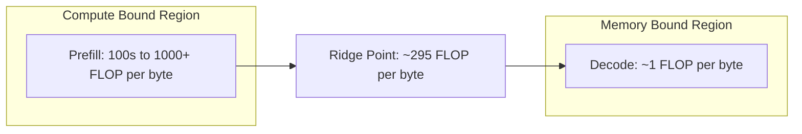

#### Hardware: Compute vs Bandwidth

Hardware evolution has aggressively targeted memory bandwidth, since it is the binding constraint on decode:

| GPU | FP16 Compute | HBM Bandwidth | Approx. Machine Balance | Notes |
| :--- | :--- | :--- | :--- | :--- |
| **H100 SXM** | 989 TFLOPS | 3.35 TB/s (HBM3) | ~295 FLOPs/byte | Hopper baseline |
| **H200** | ~989 TFLOPS | 4.8 TB/s (HBM3e) | ~206 FLOPs/byte | ~43% higher decode throughput than H100 at equal compute |
| **B200** | Not stated in sources | 8.0 TB/s | N/A — bandwidth-optimized | Blackwell; targets massive autoregressive bottlenecks |

The H200's higher bandwidth yields **43% higher decode throughput than the H100 with the same compute**, and Blackwell's B200 pushes to **8.0 TB/s** to handle massive autoregressive bottlenecks[^3][^8].

---

## State Management and the Anatomy of the KV Cache

To make autoregressive generation viable, models utilize a **Key-Value (KV) Cache**[^9]. Instead of recomputing the representations of all past tokens at every step, the system caches the previously computed Key and Value vectors for the attention layers. This trades compute for a massive memory capacity problem. The raw size scales with context length and batch:

$$\text{KV bytes} = 2 \times L \times H \times d_{head} \times \text{seq\_len} \times \text{batch} \times \text{bytes/dtype}$$

where $L$ is layer count, $H$ is head count, and the factor $2$ accounts for Keys and Values.

### Eliminating Fragmentation with PagedAttention

Early inference engines allocated contiguous memory chunks for the KV cache based on a request's maximum possible length. This static allocation led to severe internal and external memory fragmentation, **wasting up to 60–80% of GPU VRAM** and artificially capping the maximum batch size[^10].

**PagedAttention**[^11] solved this by borrowing virtual memory paging concepts from operating systems. It divides the physical KV cache into fixed-size **blocks (typically 16 or 32 tokens)**[^12] and maps a logical sequence of tokens to non-contiguous physical blocks via a **block table**. This on-demand allocation nearly eliminates fragmentation, boosting VRAM utilization to **~96%** and unlocking **2× to 4× larger batch sizes**, which directly translates to massive throughput gains in the memory-bound decode phase[^11].

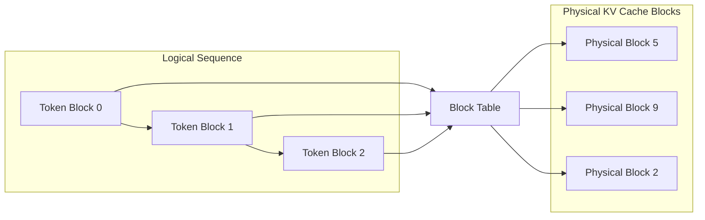

### Long-Context Mechanics: RoPE Scaling and Ring Attention

When context windows scale from 4K to 32K, 128K, or 1M tokens, two catastrophic bottlenecks emerge:
1. **Quadratic Attention Compute ($O(S^2)$):** An input prompt of 128K tokens requires evaluating $(128 \times 10^3)^2 \approx 1.64 \times 10^{10}$ attention scores per head during prefill.
2. **KV Cache Memory Footprint ($O(S)$):** For an 8-billion parameter model (e.g., Llama-3-8B with GQA: $L=32, H_{KV}=8, d_{head}=128$, FP16 precision), a single 128K context request consumes:
   $$\text{KV VRAM} = 2 \times 32 \times 8 \times 128 \times 131,072 \times 2 \text{ bytes} \approx 17.18 \text{ GB}$$
   For a 70B model ($L=80, H_{KV}=8, d_{head}=128$), a single 128K request demands **~42.95 GB** — over half of an H100 80GB GPU before accounting for model weights.

#### Rotary Position Embedding (RoPE) Extension 🟡

Transformers trained on short contexts cannot naturally extrapolate to 128K+ without adjusting position frequencies[^1]. RoPE encodes relative position $m$ by rotating the query/key vector pairs $(q_m, k_n)$ via complex rotation angles $\theta_i = b^{-2i/d}$, where $b$ is the base frequency (originally 10,000; later 500,000 in Llama-3).

* **Linear RoPE Interpolation:** Uniformly scales position indices $m \to m / \alpha$, where $\alpha = L_{new} / L_{base}$. While simple, uniform scaling uniformly compresses high-frequency dimensions, severely destroying high-frequency positional resolution essential for local grammar and syntax.
* **NTK-Aware RoPE Scaling:** Based on the Neural Tangent Kernel (NTK), NTK-aware scaling leaves high-frequency components largely intact (extrapolating local order) while scaling the low frequencies (interpolating long-distance relationships) by adjusting the base frequency:
  $$b' = b \cdot \alpha^{d / (d - 2)}$$
* **YaRN (Yet another RoPE extensioN) [^98]:** Partitions the RoPE embedding dimensions into three distinct regimes:
  1. Low dimensions (high frequency): No interpolation (pure extrapolation).
  2. High dimensions (low frequency): Full linear interpolation.
  3. Mid dimensions: Smooth ramp function between the two.
  YaRN applies a global temperature scaling factor $\sqrt{t}$ directly to the attention logits to preserve the attention entropy distribution across 128K+ contexts, preventing perplexity explosion.

#### Ring Attention: Infinite Context via Circular P2P Collectives 🔴

To run contexts beyond single-GPU memory limits without out-of-memory (OOM) errors, **Ring Attention**[^94] distributes the sequence dimension across $N$ GPUs organized in a logical ring.

Rather than gathering the entire sequence's KV cache onto one device, each GPU stores only a chunk of $S/N$ tokens. While GPU $i$ computes block attention on its local query block $Q_i$ and the current key-value block $(K_j, V_j)$, it initiates an asynchronous non-blocking peer-to-peer transfer (`P2PSend` / `P2PRecv`) sending $(K_j, V_j)$ to GPU $(i+1) \pmod N$ and receiving $(K_{j-1}, V_{j-1})$ from GPU $(i-1) \pmod N$.

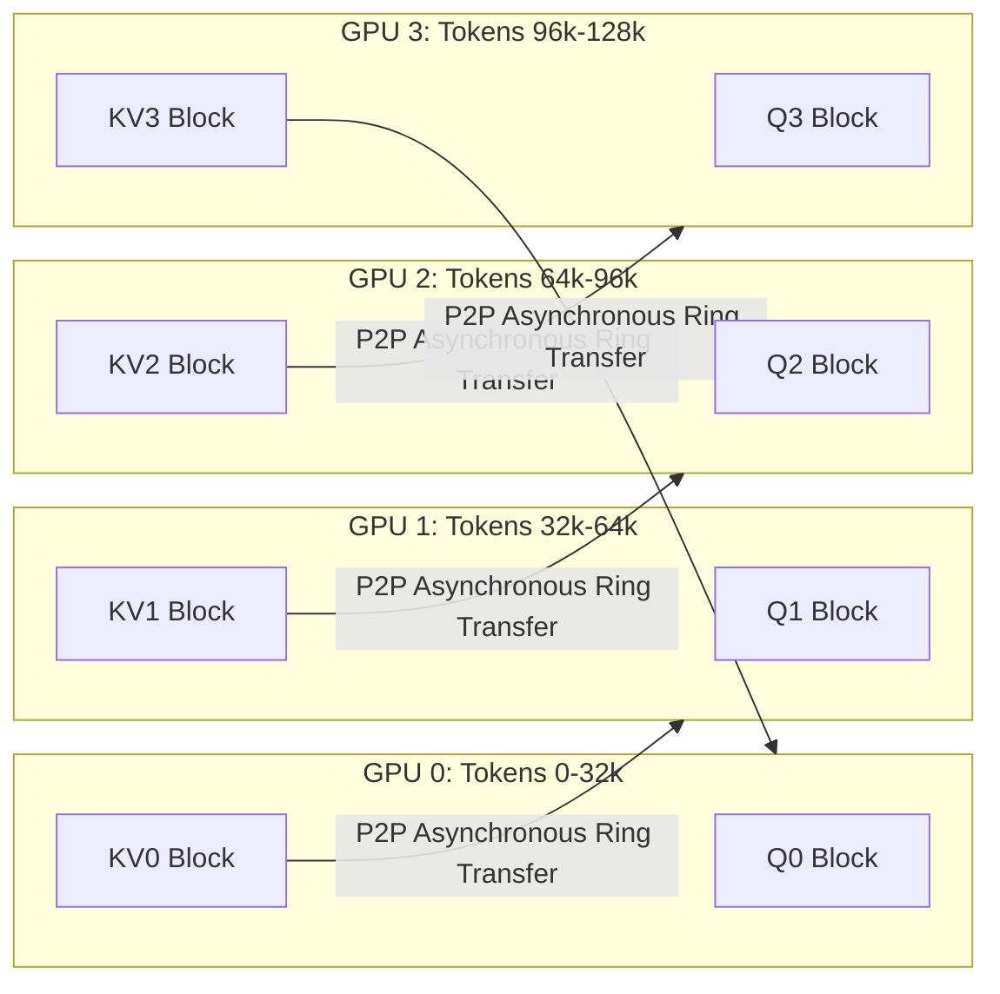

By overlapping P2P communication with the block GEMM computation, the communication overhead is effectively hidden when the block size is sufficiently large, scaling context window processing to millions of tokens linearly with GPU count.

### Sparse and Eviction-Based KV Caching 🟡

While PagedAttention and Ring Attention manage memory allocation losslessly, **Sparse KV Cache Eviction** drops non-essential tokens from memory during generation to enforce a strict memory upper bound.

#### Attention Sinks & StreamingLLM

Xiao et al. discovered the **Attention Sink** phenomenon[^95]: modern softmax-based autoregressive models dedicate an enormous portion of their attention weights to the very first 1–4 tokens (e.g., `<s>`), regardless of semantic relevance. This occurs because the softmax denominator must sum to 1; when no specific token in the context is strongly attended to, the model dumps unneeded probability mass into the initial tokens.

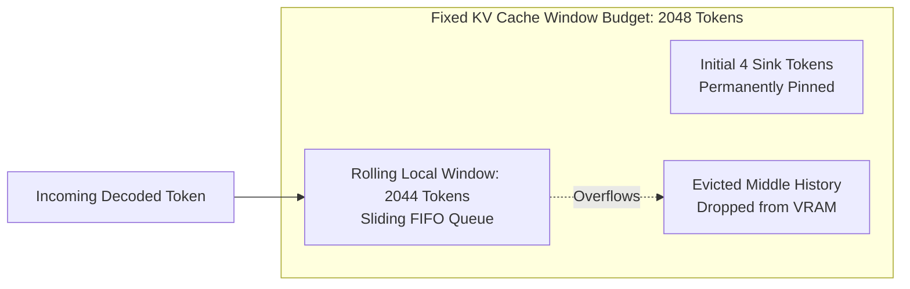

**StreamingLLM**[^95] exploits this by keeping:
1. **Initial Attention Sinks (4 tokens):** Permanently pinned in VRAM to anchor the softmax normalization.
2. **Rolling Local Window ($W \approx 2044$ tokens):** Preserves recent context via FIFO sliding window.
Tokens in the middle are discarded. This maintains stable language modeling perplexity across *infinite* sequence lengths with bounded, constant $O(W)$ memory footprint.

#### Heavy Hitter Oracle (H2O) & SnapKV

Natural language attention maps are heavily sparse; only a tiny subset of past tokens ("heavy hitters") receive the vast majority of cumulative attention scores during generation.

* **H2O (Heavy Hitter Oracle) [^96]:** Maintains a dynamic KV cache budget consisting of $K_{budget} = K_{recent} + K_{heavy}$. At each decode step, H2O tracks the accumulated attention score for every token:
  $$S_j = \sum_{t} \sum_{h} \alpha_{t, h, j}$$
  When the budget is exceeded, tokens outside the recent window with the lowest cumulative scores are pruned. H2O evicts up to **80% of KV pairs** with under 0.5 perplexity degradation.
* **SnapKV [^97]:** Tailored for prompt prefill. It analyzes attention patterns across multiple attention heads in the prompt and selects consistent, critical feature clusters, compressing the prompt KV cache into a fraction of its original size before autoregressive decode begins.

### KV Cache Strategy Comparison

| Technique | Applicability | What it optimizes | Mechanism | Lossless? | Typical Gain / Compression | Source |
| :--- | :--- | :--- | :--- | :--- | :--- | :--- |
| **PagedAttention** | 🟡 Self-Hosted | Memory fragmentation | Paged block virtual table | Yes | 60–80% waste → ~96% utilization | [^11] |
| **MLA** | 🔴 Infra (Model Arch) | Latent cache footprint | Low-rank latent + weight absorption | Yes | >90% KV reduction | [^18] |
| **YaRN / NTK RoPE** | 🟡 Self-Hosted | Context length extension | Regimes-based frequency scaling | Yes | Extends 4K model to 128K+ | [^98] |
| **Ring Attention** | 🔴 Infra | Ultra-long context VRAM | Distributed circular P2P transfers | Yes | Context scales linearly with GPU count | [^94] |
| **StreamingLLM** | 🟡 Self-Hosted | Infinite streaming context | 4 initial sinks + sliding local window | Lossy | Bounded $O(W)$ memory over infinite tokens | [^95] |
| **H2O / SnapKV** | 🟡 Self-Hosted | Runtime KV cache growth | Pruning low cumulative attention scores | Lossy | 5× KV compression, minimal perplexity loss | [^96][^97] |

---

## Distributed Inference and Parallelism Strategies 🔴

When a model's parameters or KV cache exceed the physical memory of a single accelerator, or when serving latency must be minimized below the single-GPU execution time, distributed parallelism is required. Modern inference platforms compose five orthogonal parallelism dimensions: **TP, PP, SP, EP, and DP**.

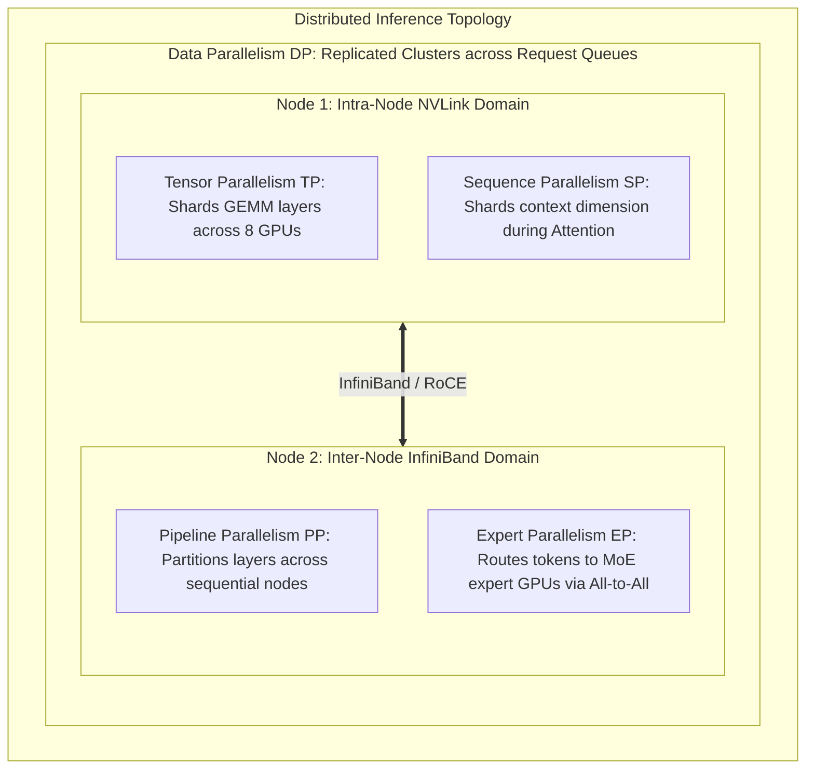

### 1. Tensor Parallelism (TP) — Intra-Node Matrix Sharding

Introduced in Megatron-LM[^93], **Tensor Parallelism** shards the weight matrices of each individual transformer layer across multiple GPUs within the same high-speed NVLink domain.

#### Column-Parallel & Row-Parallel GEMMs

A standard Transformer block consists of Multi-Head Attention (MHA) and a two-layer Feed-Forward Network (FFN/MLP). Megatron-LM pairs column-parallel and row-parallel linear layers to minimize inter-device synchronization:

1. **Multi-Head Attention:**
   * **Column-Parallel GEMM:** The Query, Key, and Value projection weight matrix $W_{QKV}$ is split along columns across $N$ GPUs:
     $$W_{QKV} = [W_{QKV, 1}, \; W_{QKV, 2}, \; \dots, \; W_{QKV, N}]$$
     Each GPU computes its local heads independently: $Y_i = X \cdot W_{QKV, i}$. No communication is required.
   * **Row-Parallel GEMM:** The output projection matrix $W_O$ is split along rows:
     $$W_O = \begin{bmatrix} W_{O, 1} \\ W_{O, 2} \\ \vdots \\ W_{O, N} \end{bmatrix}$$
     Each GPU computes a partial sum: $Z_i = Y_i \cdot W_{O, i}$. The final output requires an **All-Reduce (Sum)** collective across all $N$ GPUs:
     $$Z = \sum_{i=1}^{N} Z_i$$

2. **Feed-Forward Network (FFN):**
   * The first linear projection (or Gate/Up projections in SwiGLU) is **Column-Parallel**; no communication required before the non-linearity.
   * The down-projection matrix is **Row-Parallel**, concluding with an **All-Reduce (Sum)** collective.

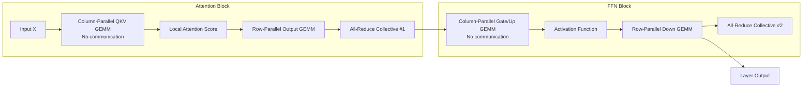

**Key Takeaways & Communication Constraints:**
* Every single Transformer layer requires exactly **2 All-Reduce collectives** in the critical path (1 for Attention, 1 for MLP).
* Because an All-Reduce transfers $2 \times \frac{N-1}{N} \times \text{bytes}$ per token, TP is extremely sensitive to latency. Over PCIe (64 GB/s) or inter-node networks, the communication time eclipses the decode GEMM computation.
* Therefore, **TP is strictly restricted to intra-node NVLink (900 GB/s on Hopper, 1.8 TB/s on Blackwell)**.
* Setting $\text{TP} > 8$ within a single node yields diminishing returns due to small sub-matrix dimensions and GPU kernel launch overheads.

---

### 2. Pipeline Parallelism (PP) — Inter-Node Layer Partitioning

**Pipeline Parallelism** divides the model's $L$ layers sequentially across $P$ pipeline stages (e.g., in a 80-layer model with $P=4$, each GPU stage runs 20 consecutive layers).

* **Communication Pattern:** Data transfer occurs exclusively at stage boundaries using point-to-point transfers (`P2PSend` / `P2PRecv`). Only activation tensors (of shape `[batch, hidden_dim]`) are passed between adjacent stages.
* **Network Suitability:** Because communication volume is minimal and occurs only between neighboring stages, PP can easily cross inter-node boundaries over standard InfiniBand (400 Gbps) or RoCE networks.
* **The Decode Bubble Penalty:** While PP is effective for training when pipelined with 1F1B schedules, for autoregressive decode at low batch sizes, PP introduces severe serialization:
  $$\text{Latency} = \sum_{p=1}^{P} T_{\text{stage } p} + (P - 1) \times \tau_{\text{network}}$$
  GPU stages $2 \dots P$ sit idle while stage 1 computes token $t+1$. PP directly inflates Inter-Token Latency (ITL). As a rule, **PP should be avoided during inference unless the model cannot fit within a single node under TP8**.

---

### 3. Sequence Parallelism (SP) — Context Sharding

In standard Megatron Tensor Parallelism, the Attention and MLP linear operations are sharded, but the LayerNorm and Dropout operations are replicated across all TP workers, duplicating activation memory.

**Megatron Sequence Parallelism [^103]:**
* Shards the sequence dimension $S$ across the TP group during LayerNorm and Dropout operations ($S / N$ tokens per GPU).
* Replaces the Attention All-Reduce with a **Reduce-Scatter** collective (which simultaneously sums partial projections and shards along the sequence dimension).
* Replaces the subsequent FFN input broadcast with an **All-Gather** collective before the next column-parallel GEMM.
* **Benefit:** Reduces activation memory by $N\times$ with zero additional communication volume (since $\text{Cost}(\text{Reduce-Scatter}) + \text{Cost}(\text{All-Gather}) = \text{Cost}(\text{All-Reduce})$).

**DeepSpeed-Ulysses / Ring-SP:**
* Partitions the entire sequence $S$ across $N$ GPUs.
* Uses an **All-to-All** collective to transpose from sequence-partitioned `[S/N, H]` to head-partitioned `[S, H/N]`, performs local FlashAttention on full sequence length for assigned heads, and transposes back via a second **All-to-All**.
* Highly efficient when sequence length is massive and number of attention heads is divisible by $N$.

---

### 4. Expert Parallelism (EP) — MoE Routing

For Mixture of Experts (MoE) architectures such as DeepSeek-V3 (671B parameters, 37B active) and Mixtral-8x22B, parameter counts are enormous, but each token only routes to a sparse subset of $K$ experts out of $E$ total experts (e.g., Top-8 out of 256 experts).

**Expert Parallelism** distributes the $E$ expert weights across different GPUs (e.g., with $E=64$ across 8 GPUs, each GPU hosts 8 dedicated experts):

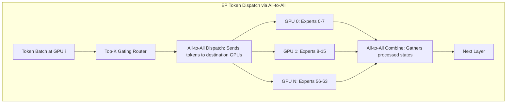

1. **Token Dispatch (All-to-All):** The router computes gating probabilities $\text{Softmax}(\text{TopK}(x \cdot W_g))$. Tokens are packed and routed to destination GPUs hosting the selected experts using an **All-to-All** collective.
2. **Local Expert Computation:** Each GPU runs GEMMs for tokens routed to its local experts.
3. **Token Combine (All-to-All):** Processed token activations are routed back to their originating GPUs via a second **All-to-All** collective, where outputs are weighted by gating coefficients and summed.

**The Expert Load Imbalance Problem:** If certain experts (e.g., common linguistic constructs or punctuation tokens) are disproportionately popular, their assigned GPUs become processing bottlenecks, forcing all other GPUs to stall during the combine collective. Modern serving stacks employ dynamic capacity limits, auxiliary-loss-free balancing, and token dropping to prevent tail-latency spikes[^102].

---

### 5. Data Parallelism (DP) & Hardware Interconnect Hierarchy

**Data Parallelism with Replicated Serving (DP):**
The entire model (or an independent TP/PP group) is replicated across distinct GPU sets. Incoming requests from the API gateway are distributed to replicas independently. Zero inter-GPU communication is required during forward passes. DP provides perfect linear scaling for cluster throughput ($QPS$) once the model fits in memory.

#### Interconnect Bandwidth & Parallelism Placement Rules

Selecting the wrong parallelism across physical boundaries will degrade inference throughput by an order of magnitude:

| Interconnect Type | Physical Domain | Unidirectional Bandwidth | Typical Collective Latency | Recommended Parallelism |
| :--- | :--- | :--- | :--- | :--- |
| **NVLink 5 (Blackwell)** | Intra-node / NVL72 rack | 900 GB/s (1.8 TB/s bi-dir) | <1 µs | **TP (up to 72), EP** |
| **NVLink 4 (Hopper)** | Intra-node (8 GPUs) | 450 GB/s (900 GB/s bi-dir) | ~1–2 µs | **TP (up to 8), SP** |
| **PCIe Gen 5** | Intra-node (budget servers) | 32 GB/s (64 GB/s bi-dir) | 5–10 µs | **Avoid TP; use DP or small PP** |
| **InfiniBand NDR / RoCE v2** | Inter-node cluster | 50 GB/s (400 Gbps bi-dir) | 10–25 µs | **PP, EP (with high batch), DP** |

#### Summary: Parallelism Strategy Decision Matrix

| Strategy | Primary Sharding Dimension | Inter-GPU Collectives | Minimum Network Requirement | Optimal Use Case |
| :--- | :--- | :--- | :--- | :--- |
| **TP (Tensor)** | Hidden dimension ($d_{model}$, heads) | 2× `All-Reduce` per layer | NVLink (≥900 GB/s) | Dense 70B+ models within a single 8-GPU node |
| **PP (Pipeline)** | Layer depth ($L$) | `P2P` activation transfer | InfiniBand (≥400 Gbps) | Massive models (>400B) spanning multiple nodes |
| **SP (Sequence)** | Sequence length ($S$) | `Reduce-Scatter` + `All-Gather` | NVLink (≥900 GB/s) | High-concurrency long-context prefill/decode |
| **EP (Expert)** | MoE Expert index ($E$) | 2× `All-to-All` per MoE layer | NVLink or optimized RoCE | DeepSeek-V3, Mixtral MoE models |
| **DP (Data)** | Request batch ($B$) | None during inference | Standard Ethernet | High-concurrency throughput scaling |

---

## Inference Serving Packages 🟡

The software ecosystem has specialized around these cache management and batching philosophies, resulting in four dominant serving engines: **vLLM**, **SGLang**, **TensorRT-LLM**, and **llama.cpp**.

### The Engine Foundation: Continuous Batching & Iteration-Level Scheduling

Early serving systems relied on **Static Batching**: requests arriving together were padded to the longest sequence in the batch. If request A required 50 tokens and request B required 1,000 tokens, request A was forced to hold GPU resources and compute dummy padding tokens until request B finished, resulting in **over 70% wasted compute and memory**.

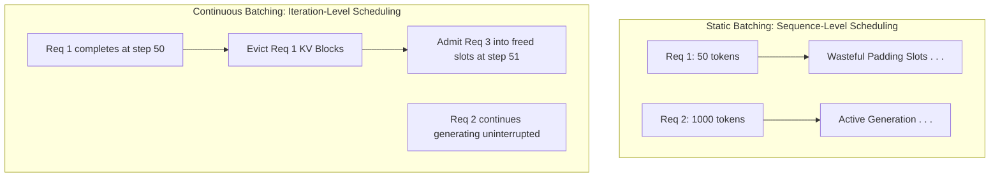

**Continuous Batching (In-Flight Batching)**[^14] introduced **iteration-level scheduling**. The inference scheduler operates on individual forward-pass steps rather than on entire requests:
* As soon as a request generates an `<eos>` token or hits its limit, it is evicted immediately, and its physical KV blocks are returned to the pool.
* Newly arrived requests are admitted into the batch at the very next decode iteration, running their prefill phase while ongoing requests continue decoding.
* Continuous batching is enabled by **PagedAttention**; without virtual memory paging, dynamically inserting new requests with unpredictable lengths would cause fatal memory fragmentation.

---

### Leading Serving Engines

#### 1. vLLM (General-Purpose Production Standard) 🟡
**vLLM** is the open-source industry standard for general-purpose inference. Pioneered at UC Berkeley, it popularized PagedAttention and continuous batching[^11][^14].
* **Architecture:** Python orchestration layer driving highly optimized CUDA/C++ kernels (FlashAttention, FlashInfer, CUTLASS).
* **Strengths:** Widest hardware ecosystem support (NVIDIA, AMD ROCm, Intel Gaudi, Google Cloud TPU, AWS Neuron). Best community support, immediate support for new open-weight architectures, and rich integrations with OpenAI-compatible API schemas.
* **Limitations:** Python GIL overhead can cap maximum request-per-second (RPS) throughput under extreme small-batch workloads; lacks built-in cluster-wide prompt cache routing across distributed worker replicas.

#### 2. SGLang (Agentic, RAG & Prefix-Heavy Workloads) 🟡
Developed by LMSYS, **SGLang** optimizes specifically for multi-turn conversations, agentic tool-use loops, few-shot prompting, and RAG workloads[^15][^17].
* **RadixAttention:** Instead of discarding prompt KV caches after completion, SGLang retains KV blocks in a Radix Tree (trie) data structure in GPU VRAM. When new requests arrive with overlapping prefixes (e.g., shared system prompts, tool schemas, or multi-turn history), SGLang performs a trie prefix lookup and skips the prefill phase entirely for the matched tokens[^16].
* **SRouter Distributed Routing:** Includes a high-performance Rust-based gateway that tracks prefix hashes across worker nodes, routing incoming requests to the specific GPU worker already caching the relevant prefix, maximizing cluster-wide cache hit rates[^26][^28].

#### 3. TensorRT-LLM (NVIDIA Enterprise Flagship) 🟡 🔴
**TensorRT-LLM** is NVIDIA's official high-performance inference framework, co-designed with NVIDIA silicon architectures from Ampere and Hopper through Blackwell[^25][^99].
* **C++ In-Flight Batching Runtime:** Implements iteration-level scheduling directly in low-overhead C++, bypassing the Python interpreter and GIL entirely. Can be deployed natively inside **Triton Inference Server** via an in-process C++ backend, achieving industry-leading throughput under ultra-high QPS conditions[^104].
* **Deep Hardware Fusion:** Leverages NVIDIA TensorRT graph optimization to fuse kernels aggressively — merging QKV projection GEMMs, RoPE transformations, bias additions, and Paged KV Attention into single unified kernel launches.
* **Native Quantization Mastery:** Features cutting-edge hardware support for FP8 (Hopper E4M3/E5M2) and NVFP4 microscaling formats (Blackwell) with fused scaling and custom GEMM epilogues[^63][^99].
* **Trade-offs:** Requires an Ahead-Of-Time (AOT) engine compilation or warm-up build phase that can take minutes; less agile than vLLM/SGLang for hacking experimental models or custom sampling logic.

#### 4. llama.cpp (Edge, Local & CPU/GPU Offloading) 🟡
**llama.cpp** dominates local inference and edge deployments. Written in pure C/C++ without external dependencies, it relies on the **GGUF** file format[^29][^30].
* **Granular Offloading:** Uses OS-level `mmap` to load models directly from disk, allowing exact allocation of layers across available GPU VRAM and host CPU RAM[^31][^32].
* **Gotchas:** When enabling FlashAttention alongside asymmetric quantized KV caches (e.g., K in 8-bit, V in 4-bit), builds must specify `FA_ALL_QUANTS`, otherwise attention silently falls back to unaccelerated CPU math[^33].

### Engine Comparison

| Engine | Applicability | Core Mechanism | Best For | Hardware Focus | Trade-off / Key Gotcha | Source |
| :--- | :--- | :--- | :--- | :--- | :--- | :--- |
| **vLLM** | 🟡 Self-Hosted | PagedAttention + Continuous Batching | General high-throughput serving | NVIDIA, AMD, TPU, Gaudi | Python GIL latency at extreme RPS | [^14][^25] |
| **SGLang** | 🟡 Self-Hosted | RadixAttention + SRouter | Multi-turn, agents, RAG, tool calling | NVIDIA, AMD | Hit rate depends on prefix locality | [^17][^26] |
| **TensorRT-LLM** | 🟡 Self-Hosted / 🔴 Infra | C++ IFB Runtime + TRT Graph Compilation | Maximum throughput & lowest tail latency | NVIDIA Only (Ampere+) | AOT compilation time; hardware lock-in | [^25][^99] |
| **llama.cpp** | 🟡 Self-Hosted | GGUF + `mmap` + Granular Layer Offload | Edge, local Mac/PC, CPU+GPU hybrid | CPU, Apple Silicon, consumer GPU | Slower batched throughput than GPU servers | [^29][^32] |

---

## Inference Backends and Kernels

Beneath the serving engines, GPU kernels execute the actual math. The standard self-attention operation scales quadratically $O(N^2)$ and is severely bottlenecked by reading and writing the massive $N \times N$ intermediate attention matrices to HBM[^34].

**FlashAttention** mitigates this through **Tiling** and **Online Softmax**. By breaking the Query, Key, and Value matrices into blocks that fit entirely into the GPU's ultra-fast SRAM, it computes the attention scores and outputs locally without ever writing the $N \times N$ matrix to HBM. The mathematical hurdle — calculating a softmax denominator over an incomplete row — is solved by the Online Softmax algorithm, which maintains running maximums and sums, dynamically rescaling previous outputs by a factor of $e^{m_{old} - m_{new}}$ as new block maximums are discovered[^34][^35][^36].

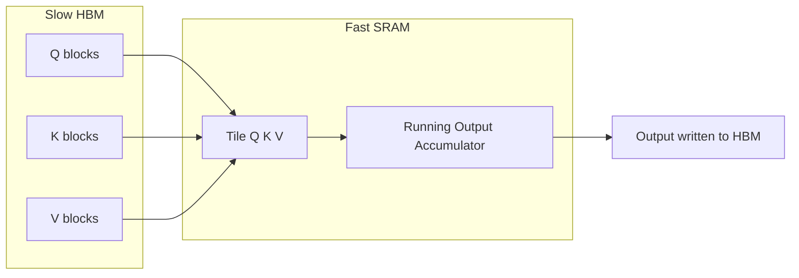

### Attention Kernel Evolution

| Kernel | Target architecture | Key primitives | Memory technique | Headline |
| :--- | :--- | :--- | :--- | :--- |
| **Vanilla attention** | Any | Materializes $N \times N$ | High HBM traffic | $O(N^2)$ memory-bound |
| **FlashAttention-2** | Turing+ | Tiling + Online Softmax | No HBM materialization | Baseline fused attention |
| **FA3** | Hopper | TMA, WGMMA, ping-pong scheduling | Async overlap of GEMM + softmax | Up to 75% of H100 peak FLOPS[^38] |
| **FA4** | Blackwell (B200/GB200) | `tcgen05.mma`, TMEM, 2-CTA MMA | FMA-emulated exponentials | ~1600 TFLOPs/s BF16[^44] |
| **FlashInfer** | Multi-arch | JIT-compiled, unified block-sparse | Runtime load balancing | Flexible paged/ragged KV[^45] |

### FlashAttention-3 (FA3)

FA3 optimizes for the **Hopper** architecture. It uses the **Tensor Memory Accelerator (TMA)** for asynchronous data movement and **Warpgroup Matrix Multiply-Accumulate (WGMMA)** instructions. By employing **ping-pong scheduling**, it overlaps GEMM computations with the slower softmax ALU operations, achieving up to **75% of the H100's theoretical peak FLOPS**[^38].

### FlashAttention-4 (FA4)

FA4 is built for the **Blackwell** architecture (B200/GB200) to address asymmetric hardware scaling. It leverages new `tcgen05.mma` instructions, a new dedicated **Tensor Memory (TMEM)** space, and **2-CTA MMA** (where two thread blocks share operands) to drastically reduce memory traffic. It also uses software-emulated exponentials on FMA units to prevent the **Special Function Units (SFU)** from bottlenecking the softmax[^41][^42]. FA4 reaches a staggering **~1600 TFLOPs/s in BF16 on the B200**[^44].

### FlashInfer

**FlashInfer** provides a highly flexible alternative. It acts as a **Just-In-Time (JIT)** compiled attention engine that utilizes a unified **block-sparse format** to handle varying KV cache structures (like Paged or Ragged caches). FlashInfer separates compile-time tile generation from a runtime dynamic load-balancer, adapting efficiently to varying sequence lengths[^45][^46].

---

## Modern Inference Optimization Techniques

### Disaggregation and Chunked Prefill

A single `vllm serve` process does **three jobs** with nothing in common: compute-bound prefill, memory-bandwidth-bound decode, and pure CPU work (tokenization, chat templating, tool/reasoning parsing). Co-locating them on the same GPU forces these workloads to interfere: a large incoming prefill stalls every live decode stream until it completes, producing severe token jitter[^5].

> **Goodput vs. throughput.** The pitch for disaggregation is not peak throughput — splitting the same GPUs into prefill and decode pools will not necessarily move more tokens per second with no latency target. What it buys is **goodput**: the request rate you can sustain while every request still meets *both* its TTFT and ITL SLA targets simultaneously[^5][^53].

Three orthogonal splits can be applied independently or combined:

#### 1. Chunked Prefill (Same GPU)

**Chunked Prefill** (Sarathi-style) mitigates interference locally by splitting a large prompt into ~2048-token blocks and interleaving each block with ongoing decode steps, smoothing latency spikes without additional hardware[^50]. The right chunk size depends on traffic mix, so it often needs retuning as load changes.

#### 2. Prefill / Decode (P/D) Disaggregation

**P/D Disaggregation** (DistServe, Splitwise, Mooncake, vLLM v0.30+) solves the problem architecturally: prefill runs on a pool of FLOP-heavy GPUs, and the resulting KV cache streams over NVLink or RDMA to a separate pool of decode-only GPUs[^52]. TTFT and ITL can now be sized and tuned independently — different parallelism topologies on each tier, sized for the phase they run.

KV cache transfer is the key operational variable. For Llama-3.1-70B in BF16, a 10K-token prompt produces **~3 GB of KV data** (320 KiB/token) that must cross the wire before decode can emit a single token. At a 400 Gb/s line rate this is ~65 ms minimum, with additional polling overhead on top. **Verify GPU peer-to-peer connectivity before benchmarking** — without RDMA or NVLink, PCIe-only transfer overhead can make P/D worse than collocated at low request rates.

**Real-world goodput benchmarks (vLLM blog, Sep 2026):**

| Setup | Model / Workload | Result | Caveat |
| :--- | :--- | :--- | :--- |
| 2× L40S (PCIe, no NVLink) | Qwen2.5-7B, ~8K prompts, 256 output | Co-located p99 ITL ≈ **6× higher** at 0.4–0.6 req/s; P/D p99 flat | No GPU peer-to-peer → 1.3 s KV transfer per request; P/D hurt at low rates |
| 8× AMD MI300X, single node | Qwen3-235B-A22B-FP8, MoRI-IO connector | **73/100** requests met 1 s TTFT + 50 ms ITL vs 30/100 collocated → **2.4× goodput** | Assumes fast intra-node path |
| 16× H200, llm-d cluster | gpt-oss-120b | **59% lower mean E2E latency · 67% lower P95** vs aggregated replicas | Requires RDMA fabric between nodes |

#### 3. GPU-less Render Tier (vLLM v0.30+)

A third split moves all CPU work — tokenization, chat templating, reasoning parsing, and tool call parsing — off the GPU box entirely. The engine is reduced to a pure token-in / token-out service[^vllm-disagg-blog]:

| Endpoint | Role | Hardware |
| :--- | :--- | :--- |
| `/render` | Chat template + tokenization → token IDs | CPU only |
| `/inference/v1/generate` | Token IDs → token IDs | GPU (pure compute) |
| `/derender` | Token IDs → OpenAI response (`content`, `reasoning`, `tool_calls`) | CPU only |

The render tier is stateless even when streaming, so it scales like any stateless web service — replicas behind a load balancer, sized on CPU utilization rather than GPU time. Templating and tokenizing a 9K-token chat prompt costs ~15 ms of CPU; one render server handles ~73 req/s on a single core. Streaming derender **with a reasoning or tool parser** is significantly more expensive — each chunk replays token history through a fresh parser instance (O(n³) character work over long generations), so size the worker count accordingly.

#### 4. Bidirectional KV Transfer for Multi-Turn

Standard P/D is one-directional: decode holds KV for the response it just generated, but prefill has never seen it, so it recomputes the prior turn from scratch on every new user message. With **bidirectional KV transfer**, prefill instead pulls those blocks back from decode, computing only the new tokens — critical for chat and agentic loops where the conversation history dominates prompt length.

> ⚠️ **Known issue:** Reasoning models (e.g., Qwen3) drop thinking traces in the next turn's chat template. If the prompt no longer includes the prior thinking trace, prefill's prompt misaligns with decode's cached blocks and produces **wrong output, not just slow output**. Verify your chat template before enabling bidirectional KV on reasoning models.

#### KV Connector Ecosystem (vLLM v0.30+)

More than a dozen KV connectors are upstream. The choice of connector determines transfer throughput and failure semantics:

| Connector | Vendor | Notes |
| :--- | :--- | :--- |
| **NIXL** | vLLM upstream | Default RDMA connector; unique side-channel port per worker |
| **LMCache** | Open source | Prefix-aware caching layer with tiered storage support |
| **Mooncake** | Moonshot AI | Production-grade; used in Kimi K3 serving |
| **FlexKV** | Community | Flexible multi-backend KV routing |
| **MoRI-IO** | AMD | Optimised for MI300X intra-node transfers |
| **MultiConnector** | vLLM upstream | Chains multiple connectors in sequence |

**Production orchestrators:** llm-d (router + EPP scheduler), NVIDIA Dynamo (Kubernetes), KServe (via `LLMInferenceService`), vLLM production stack (Helm), AIBrix (control plane). The toy proxy in `tests/` is for development only.

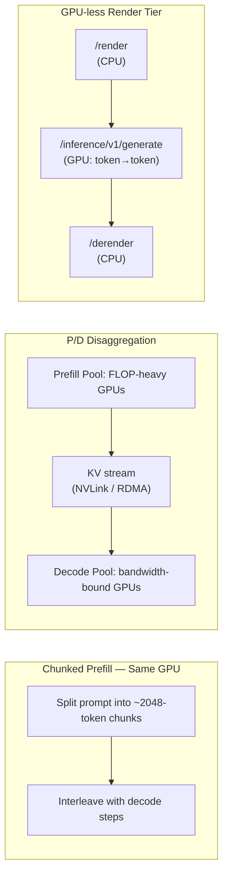

### Advanced Quantization

Quantization compresses models to fit into smaller VRAM and reduces memory bandwidth pressure during decoding. For a deeper treatment of the underlying formats and algorithms, see the sibling survey [`LLM Quantization Methods Survey.md`](../quantization/LLM%20Quantization%20Methods%20Survey.md).

| Method | Type | Precision | Mechanism | Hardware | Source |
| :--- | :--- | :--- | :--- | :--- | :--- |
| **AWQ** | Weight-only | ~4-bit | Protects top 1% salient weights | Ampere+ | [^56] |
| **GPTQ** | Weight-only | ~4-bit | Inverse Hessian error compensation | Ampere+ | [^58] |
| **FP8** | Weight + activation | E4M3 / E5M2 | Native 8-bit float | Hopper, Ada | [^61] |
| **NVFP4** | Weight + activation | 4-bit microscaling | Two-level scales (local FP8 + global FP32) | Blackwell | [^64] |

- **AWQ and GPTQ:** Weight-only quantization. AWQ observes activation dynamics to identify and protect the top 1% of "salient weights" in higher precision, compressing the rest to 4-bit with minimal quality loss[^56]. GPTQ relies on inverse Hessian matrices to compensate for quantization errors[^58].
- **FP8 and NVFP4:** Hopper introduced native FP8 (E4M3 for weights, E5M2 for activations)[^61]. Blackwell advances this to 4-bit microscaling with **NVFP4**. NVFP4 uses a two-level scaling strategy, grouping parameters into fine-grained $16 \times 16$ or $1 \times 16$ blocks with local FP8 scales, plus a global FP32 scale, allowing models to run in 4-bit precision with the accuracy of 16-bit models[^64].

### Speculative Decoding and Multi-Token Prediction (MTP)

Because the decode phase is starved for compute, **Speculative Decoding** uses excess GPU FLOPs to "draft" several future tokens using a small, cheap model, and then verifies them in parallel using the large target model. Based on Leviathan's rejection sampling proof, if a draft token is rejected, the system resamples from a normalized residual distribution, guaranteeing that the final output perfectly matches the target model's original probability distribution mathematically (lossless)[^72][^69]. Given target distribution $p$ and draft distribution $q$, a rejected token is corrected by the residual, renormalized so it remains a valid distribution:

$$p'(x) = \frac{\max(0, \; p(x) - q(x))}{\sum_{x'} \max(0, \; p(x') - q(x'))}$$

Modern variants eliminate the separate draft model:

| Variant | Approach | Acceptance rate | Speedup | Source |
| :--- | :--- | :--- | :--- | :--- |
| **Classic draft-model** | Separate small draft model | Model-dependent | Model-dependent | [^72] |
| **Medusa** | Multiple lightweight heads on target | Model-dependent | Model-dependent | [^73] |
| **EAGLE / EAGLE-2** | Speculation in feature space (hidden states) | 75–85% | 2.5× – 4× | [^73][^75] |
| **MTP** | Speculative heads baked into pre-training (e.g., DeepSeek-V3) | High | Model-dependent | [^77] |

- **Medusa:** Adds multiple lightweight heads to the target model to predict parallel tokens[^73].
- **EAGLE / EAGLE-2:** Speculates in the *feature space* (hidden states) rather than the token space. EAGLE-2 uses dynamic "tree attention" to verify multiple branches of drafted tokens simultaneously based on confidence scores, achieving acceptance rates of **75–85%** and speedups of **2.5× to 4×**[^73][^75].
- **Multi-Token Prediction (MTP):** Models like DeepSeek-V3 bake these speculative prediction heads directly into the pre-training phase, drastically improving draft accuracy during inference serving[^77].

---

### Decoding and Sampling Strategies 🟢

Once the model's final linear projection produces raw unnormalized log-probabilities (**logits**) $z \in \mathbb{R}^{|V|}$ over the vocabulary $V$, a **decoding and sampling strategy** converts these logits into discrete output tokens. Sampling strategies dictate the fundamental trade-off between deterministic precision and linguistic diversity.

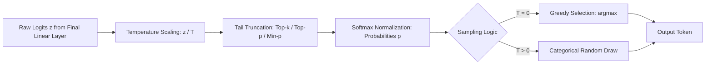

#### 1. Greedy Search ($T = 0$)
* **Mechanism:** Selects the token with the highest logit: $t = \operatorname{argmax}_i z_i$.
* **Characteristics:** Completely deterministic, zero sampling compute overhead, fastest generation speed.
* **Failure Modes:** Highly vulnerable to repetitive phrasing, cyclical degeneration loops, and suboptimal local minima in long-form creative generation. Ideal for deterministic tasks: mathematics, coding, and strict factual extraction.

#### 2. Temperature Scaling ($T$)
* **Mechanism:** Divides logits by scalar $T$ before softmax:
  $$p_i = \frac{\exp(z_i / T)}{\sum_{j=1}^{|V|} \exp(z_j / T)}$$
* **$T < 1.0$ (Sharpening):** Exaggerates differences between top tokens. Probability mass concentrates on the highest-confidence tokens, reducing hallucination risk.
* **$T > 1.0$ (Flattening):** Compresses relative logit differences toward a uniform distribution, raising the probability of low-confidence tail tokens for creative writing.

#### 3. Top-$k$ Truncation
* **Mechanism:** Restricts candidates to the $k$ tokens with the highest probabilities; all other logits are set to $-\infty$:
  $$V^{(k)} = \operatorname{argtopk}(z, k)$$
* **Limitation:** Static threshold. When the model is uncertain and many plausible tokens exist, $k$ is too restrictive. When the model is 99% confident in a single token, $k$ forces low-quality tokens into consideration.

#### 4. Top-$p$ (Nucleus) Sampling [^100]
* **Mechanism:** Dynamically retains the smallest set of tokens whose cumulative probability exceeds threshold $p \in (0, 1]$:
  $$V^{(p)} = \left\{ i \in V \mid \sum_{j \in V^{(p)}} p_j \ge p \right\}$$
* **Advantage:** Dynamically expands candidate pool size when entropy is high (uncertainty) and shrinks to 1 token when entropy is low.
* **Flaw:** If the tail is flat, top-$p$ can still admit inappropriate, low-probability tokens to meet the probability quota.

#### 5. Min-$p$ Sampling [^101]
* **Mechanism:** Dynamically truncates any token whose probability falls below a threshold proportional to the top token's probability:
  $$\text{Keep token } i \iff p_i \ge p_{\min} \times \max_{j}(p_j)$$
* **Advantage:** Self-calibrating to model confidence:
  * When top token probability is **0.90** and $p_{\min} = 0.1$, cutoff is $0.09$, discarding the remaining 10% tail entirely.
  * When top token probability is **0.15** (high uncertainty), cutoff is $0.015$, opening the pool to diverse viable choices.
  Min-$p$ eliminates the incoherent "long tail" noise of top-$p$ without sacrificing expressive vocabulary.

#### 6. Beam Search
* **Mechanism:** Maintains $B$ parallel partial sequence hypotheses ("beams"), ranking candidates by cumulative log-probability.
* **Production Status:** Largely deprecated for long-form LLM inference. Beam search requires **$B\times$ KV cache VRAM footprint**, causes massive decode latency stalls, and leads to unnaturally repetitive, generic prose in autoregressive LLMs. It has been superseded by sampling with **Best-of-$N$ reranking** or test-time verifiers.

#### Sampling Strategies Comparison

| Strategy | Applicability | Formula / Logic | Hyperparameter Range | Memory / Latency Overhead | Optimal Use Case |
| :--- | :--- | :--- | :--- | :--- | :--- |
| **Greedy** | 🟢 API | $t = \operatorname{argmax}_i z_i$ | None ($T=0$) | Zero overhead | Code generation, math, SQL, deterministic APIs |
| **Temperature** | 🟢 API | $z_i / T$ | $T \in [0.1, 2.0]$ | Trivial scalar division | Global control of randomness vs determinism |
| **Top-$k$** | 🟢 API | Top $k$ logits kept | $k \in [20, 100]$ | Quick sort / top-k selection | Coarse tail-cutoff baseline |
| **Top-$p$ (Nucleus)** | 🟢 API | Cumulative sum $\ge p$ | $p \in [0.8, 0.95]$ | Cumulative sum sort | Adaptive vocabulary across varying entropy |
| **Min-$p$** | 🟢 API / 🟡 Self-Hosted | $p_i \ge p_{\min} \cdot p_{\max}$ | $p_{\min} \in [0.05, 0.1]$ | Max reduction + comparison | High-coherence reasoning, dialogue, creative writing |
| **Beam Search** | 🟡 Self-Hosted | Maintain $B$ hypotheses | $B \in [2, 8]$ | **$B\times$ VRAM & latency** | Machine translation, short deterministic extraction |

---

### Structured Output and Constrained Decoding 🟡

In agentic and autonomous systems, LLMs must reliably produce structured formats (JSON, tool call arguments, YAML, SQL). Without constraints, models suffer from syntax breakage (unclosed braces, invalid keys), breaking downstream parsing pipelines[^80][^81].

#### Mechanism: Logit Masking via Finite State Machines (FSMs) & PDAs

Constrained decoding enforces grammar validity during the autoregressive decode loop:
1. **Grammar Compilation:** A JSON Schema or Regular Expression is precompiled into a **Deterministic Finite Automaton (DFA/FSM)** or a **Pushdown Automaton (PDA)** for context-free grammars[^84][^86].
2. **State Tracking:** The engine maintains the current state in the automaton based on generated tokens.
3. **Logit Masking:** Before the softmax step, the engine determines which tokens in the vocabulary $V$ represent valid grammatical transitions from the current state. Invalid tokens receive $-\infty$:
   $$z'_i = \begin{cases} z_i & \text{if token } i \text{ is syntactically valid} \\ -\infty & \text{otherwise} \end{cases}$$

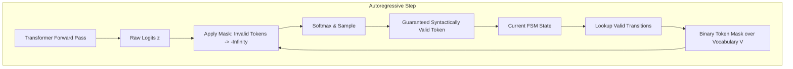

#### Modern Constrained Decoding Engines

* **xGrammar [^87][^88]:** Supports arbitrary Context-Free Grammars (CFGs). Precomputes token-to-character mappings and leverages efficient bit-parallel algorithms to reduce per-token parsing latency to microseconds.
* **Outlines & llguidance [^86]:** Outlines precomputes an index mapping each FSM state to a compressed bitmask of allowable token IDs. llguidance integrates directly with C++ runtimes to provide zero-copy token filtering.
* **Asynchronous Bitmasking [^85]:** Rather than stalling GPU execution while CPU parses the grammar, asynchronous engines precompute valid bitmasks on host CPU threads concurrently while the GPU runs the current forward pass, reducing constrained decoding latency overhead to **under 2%**.

---

## Breaking the Autoregressive Paradigm: Diffusion LLMs

While speculative decoding speeds up autoregression, models like **DiffusionGemma** are attempting to break the sequential bottleneck entirely using **discrete text diffusion**[^89].

Using an encoder-decoder architecture, DiffusionGemma starts with a fixed-length "canvas" of random noise (e.g., 256 random tokens). It applies bidirectional attention across the canvas. A specialized **EntropyBoundSampler** evaluates the confidence (entropy) of the predictions; low-entropy (highly confident) tokens are locked in, while the rest are re-noised and refined in subsequent parallel steps[^90]. This allows hundreds of tokens to anneal simultaneously into coherent text, offering a glimpse into the future of ultra-fast, non-autoregressive parallel generation.

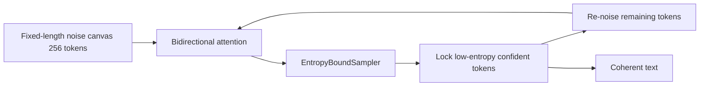

---

## Glossary and Deployment Checklist

| Term | Meaning |
| :--- | :--- |
| **TTFT** | Time-to-First-Token; dominated by prefill |
| **TPOT / ITL** | Time-Per-Output-Token / Inter-Token Latency; dominated by decode |
| **GEMM** | General Matrix Multiplication |
| **HBM / SRAM** | High Bandwidth Memory (device DRAM) / on-chip scratchpad |
| **TMA** | Tensor Memory Accelerator (Hopper async copy engine) |
| **WGMMA** | Warpgroup Matrix Multiply-Accumulate |
| **TMEM** | Tensor Memory (Blackwell dedicated MMA accumulator space) |
| **SFU** | Special Function Unit (hardware transcendental unit) |
| **MLA** | Multi-Head Latent Attention |
| **TP** | Tensor Parallelism (intra-node GEMM weight sharding via All-Reduce) |
| **PP** | Pipeline Parallelism (inter-node layer sharding via P2P transfers) |
| **SP** | Sequence Parallelism (sequence dimension sharding for attention/activations) |
| **EP** | Expert Parallelism (MoE expert distribution via All-to-All collectives) |
| **DP** | Data Parallelism (replicated models serving disjoint request batches) |
| **IFB** | In-Flight Batching (iteration-level continuous scheduling) |
| **RoPE** | Rotary Position Embedding |
| **YaRN** | Yet another RoPE extensioN (multi-band frequency scaling for long context) |
| **H2O** | Heavy Hitter Oracle (dynamic attention-score KV cache eviction) |
| **DFA / PDA** | Deterministic Finite Automaton / Pushdown Automaton (grammar engines) |

**Production deployment checklist**

- [ ] Enable **continuous batching** (in-flight batching) to swap completed sequences on the fly without padding overhead.
- [ ] Enable **prefix/prompt caching** (RadixAttention) and place invariant system instructions at the prompt head.
- [ ] Quantize weights and KV cache (**FP8 / NVFP4 / KV4**) to relieve decode memory bandwidth pressure.
- [ ] Restrict **Tensor Parallelism (TP)** strictly within the high-speed NVLink domain (typically $\le 8$ GPUs per node).
- [ ] Deploy **Pipeline Parallelism (PP)** or **Data Parallelism (DP)** across nodes to prevent high-latency All-Reduce collective stalls over InfiniBand or Ethernet.
- [ ] For Mixture of Experts (MoE), balance **Expert Parallelism (EP)** dispatch buffers to prevent expert hotspot stalls.
- [ ] For ultra-long contexts (>32K tokens), evaluate **StreamingLLM attention sinks** or **H2O / SnapKV eviction** to avoid OOM crashes.
- [ ] Configure **Min-$p$ sampling** ($p_{\min} \in [0.05, 0.1]$) to eliminate flat-tail hallucinations while preserving expressive vocabulary.
- [ ] Enable **asynchronous grammar-constrained decoding** (xGrammar / llguidance) for JSON/tool-calling schemas to eliminate parser latency stalls.
- [ ] Use **chunked prefill** to smooth TTFT spikes under mixed batch workloads.
- [ ] Evaluate **prefill-decode disaggregation** when strict P99 TTFT + ITL SLAs are required — verify GPU peer-to-peer connectivity before benchmarking; PCIe-only boxes may see transfer overhead that outweighs gains.
- [ ] For multi-turn / agentic workloads, enable **bidirectional KV transfer** so prefill pulls prior-turn blocks from decode instead of recomputing them. Validate chat template compatibility first for reasoning models.
- [ ] Move tokenization, templating, and tool/reasoning parsing off GPU nodes with the **vLLM render tier** (`/render` + `/derender`) to scale CPU work independently and reduce GPU idle time.
- [ ] Add **speculative decoding / MTP** when spare compute exists during decode.
- [ ] Instrument **TTFT, TPOT, and p95/p50 latency spread** as first-class observability signals.

---

## Conclusion

The architecture of LLM inference is evolving rapidly to overcome the physical limits of memory bandwidth. By virtualizing memory (PagedAttention) and mathematically compressing it (MLA), inference engines have drastically reduced memory bottlenecks. At the hardware level, kernels like FlashAttention-4 natively exploit Blackwell's TMEM and asynchronous pipelines to push tensor cores to their absolute limits. At the system level, the field has moved beyond simple prefill/decode disaggregation to a **four-tier serving architecture**: a GPU-less render tier handles all CPU work (tokenization, parsing), separate prefill and decode pools each run at their optimal parallelism, and KV cache transfers over RDMA bind them together. The key insight driving this shift is **goodput** — not raw throughput, but the request rate sustainable while all requests simultaneously meet their TTFT and ITL SLAs. Coupled with NVFP4 microscaling and EAGLE-based Multi-Token Prediction, the AI industry is successfully transforming heavy monolithic models into efficient, SLA-aware distributed computing engines.

---

#### **Nguồn trích dẫn**

> 1. Unifying Mixture of Experts and Multi-Head Latent Attention ... \- arXiv, [https://arxiv.org/abs/2508.01261](https://arxiv.org/abs/2508.01261)
> 2. A Survey on Efficient Inference for Large Language Models \- arXiv, [https://arxiv.org/html/2404.14294v3](https://arxiv.org/html/2404.14294v3)
> 3. GPU Inference Performance: Prefill, Decode & Batching Explained, [https://intuitionlabs.ai/articles/gpu-inference-performance-prefill-decode-batching](https://intuitionlabs.ai/articles/gpu-inference-performance-prefill-decode-batching)
> 4. GPU Inference: H100 vs A100 vs L4, [https://inferenceengineering.tech/learn/gpu-inference/](https://inferenceengineering.tech/learn/gpu-inference/)
> 5. DistServe: Disaggregating Prefill and Decoding for Goodput, [https://www.usenix.org/system/files/osdi24-zhong-yinmin.pdf](https://www.usenix.org/system/files/osdi24-zhong-yinmin.pdf)
> 6. vLLM vs SGLang 2026: RadixAttention vs PagedAttention Benchmarks, [https://www.spheron.network/blog/vllm-vs-sglang-2026/](https://www.spheron.network/blog/vllm-vs-sglang-2026/)
> 7. How to Think About GPUs | How To Scale Your Model \- GitHub Pages, [https://jax-ml.github.io/scaling-book/gpus/](https://jax-ml.github.io/scaling-book/gpus/)
> 8. NVIDIA B200 vs H200 GPU for Inference: Architecture & Benchmarks, [https://lyceum.technology/magazine/b200-vs-h200-gpu-for-inference/](https://lyceum.technology/magazine/b200-vs-h200-gpu-for-inference/)
> 9. Understanding KV Cache \- by Bijit Ghosh \- Medium, [https://medium.com/@bijit211987/understanding-kv-cache-fcd1641b631d](https://medium.com/@bijit211987/understanding-kv-cache-fcd1641b631d)
> 10. vllm vs sglang \- Newline, [https://www.newline.co/@zaoyang/vllm-vs-sglang--f1fb8ee2](https://www.newline.co/@zaoyang/vllm-vs-sglang--f1fb8ee2)
> 11. PagedAttention: vLLM's OS-style KV cache memory manager, [https://zeroentropy.dev/concepts/paged-attention/](https://zeroentropy.dev/concepts/paged-attention/)
> 12. Sparse Buffers for KV Cache on Apple Metal | Mirai Labs, [https://trymirai.com/blog/sparse-buffers-for-kv-cache](https://trymirai.com/blog/sparse-buffers-for-kv-cache)
> 13. vToken: Turning Token-Level KV Eviction into Actually Reusable, [https://www.zhongzhuzhou.org/blog/2026-08-16-vtoken-technical-review-en/](https://www.zhongzhuzhou.org/blog/2026-08-16-vtoken-technical-review-en/)
> 14. PagedAttention vs Continuous Batching vs vLLM vs SGLang, [https://python.plainenglish.io/pagedattention-vs-continuous-batching-vs-vllm-vs-sglang-a-practical-breakdown-4c19cc9e21c0](https://python.plainenglish.io/pagedattention-vs-continuous-batching-vs-vllm-vs-sglang-a-practical-breakdown-4c19cc9e21c0)
> 15. Server Arguments \- SGLang Documentation, [https://sgl-project.github.io/advanced\_features/server\_arguments.html](https://sgl-project.github.io/advanced_features/server_arguments.html)
> 16. Chapter 29: Prefix caching, prompt caching, radix attention, [https://www.kunwar.page/chapter/029-prefix-caching-prompt-caching-radix-attention](https://www.kunwar.page/chapter/029-prefix-caching-prompt-caching-radix-attention)
> 17. SGLang Deep Dive: Inside SGLang \- SugiV Blog, [https://blog.sugiv.fyi/sglang-deep-dive-inside-sglang](https://blog.sugiv.fyi/sglang-deep-dive-inside-sglang)
> 18. DeepSeek's Multi-Head Latent Attention \- Lior Sinai, [https://liorsinai.github.io/machine-learning/2025/02/22/mla.html](https://liorsinai.github.io/machine-learning/2025/02/22/mla.html)
> 19. Understanding Multi-Head Latent Attention, [https://planetbanatt.net/articles/mla.html](https://planetbanatt.net/articles/mla.html)
> 20. DeepSeek-V3 Technical Report \- arXiv, [https://arxiv.org/pdf/2412.19437](https://arxiv.org/pdf/2412.19437)
> 21. DeepSeek \+ SGLang: Multi-Head Latent Attention \- Verda, [https://verda.com/blog/deepseek-sglang-multi-head-latent-attention](https://verda.com/blog/deepseek-sglang-multi-head-latent-attention)
> 22. Towards Economical Inference: Enabling DeepSeek's Multi-Head, [https://arxiv.org/abs/2502.14837](https://arxiv.org/abs/2502.14837)
> 23. From 390 KB to 890 Bytes — DeepSeek's KV Cache Optimization, [https://local-ai-zone.github.io/blog/deepseek-kv-cache-optimization-research-paper.html](https://local-ai-zone.github.io/blog/deepseek-kv-cache-optimization-research-paper.html)
> 24. vLLM vs SGLang: Enterprise LLM Inference Comparison, [https://dev.to/ljhao/vllm-vs-sglang-enterprise-llm-inference-comparison-3dg3](https://dev.to/ljhao/vllm-vs-sglang-enterprise-llm-inference-comparison-3dg3)
> 25. vLLM vs SGLang vs TensorRT-LLM \- Inference Engineering, [https://inferenceengineering.tech/learn/vllm-vs-sglang-vs-tensorrt-llm/](https://inferenceengineering.tech/learn/vllm-vs-sglang-vs-tensorrt-llm/)
> 26. SGLang Router \- Vast.ai Documentation: Affordable GPU Cloud, [https://docs.vast.ai/examples/serving-infrastructure/sglang-router-vast](https://docs.vast.ai/examples/serving-infrastructure/sglang-router-vast)
> 27. sglang-router \- PyPI, [https://pypi.org/project/sglang-router/0.1.5/](https://pypi.org/project/sglang-router/0.1.5/)
> 28. Routing and Gateway Infrastructure | kvcache-ai/sglang \- DeepWiki, [https://deepwiki.com/kvcache-ai/sglang/11-routing-and-gateway-infrastructure](https://deepwiki.com/kvcache-ai/sglang/11-routing-and-gateway-infrastructure)
> 29. llama.cpp memory and GGUF \- Tokenminning, [https://tokenminning.ai/self-hosting/llama-cpp/memory](https://tokenminning.ai/self-hosting/llama-cpp/memory)
> 30. llama.cpp and GGUF Quantization: Local LLM Deployment, [https://rubythalib.ai/en/articles/llamacpp-dan-gguf-quantization-deploy-llm-secara-lokal](https://rubythalib.ai/en/articles/llamacpp-dan-gguf-quantization-deploy-llm-secara-lokal)
> 31. llama.cpp/tools/server/README.md at master · ggml-org ... \- GitHub, [https://github.com/ggml-org/llama.cpp/blob/master/tools/server/README.md](https://github.com/ggml-org/llama.cpp/blob/master/tools/server/README.md)
> 32. GPU VRAM, CPU Offload, and llama.cpp: The Real Performance Cliff, [https://sergiiob.dev/posts/gpu-vram-cpu-offload-llama-cpp-deep-dive/](https://sergiiob.dev/posts/gpu-vram-cpu-offload-llama-cpp-deep-dive/)
> 33. GGUF Inference with llama.cpp: A Real Deployment Guide (2026), [https://www.qwe.edu.pl/ai-tools/gguf-inference-llama-cpp/](https://www.qwe.edu.pl/ai-tools/gguf-inference-llama-cpp/)
> 34. FlashAttention and the GPU memory hierarchy \- The Holy Grail, [https://www.kunwar.page/chapter/025-flashattention-and-the-gpu-memory-hierarchy](https://www.kunwar.page/chapter/025-flashattention-and-the-gpu-memory-hierarchy)
> 35. 2.2a: FlashAttention — The Tiling Strategy \- Hugging Face, [https://huggingface.co/blog/atharv6f/flash-attention-basics](https://huggingface.co/blog/atharv6f/flash-attention-basics)
> 36. Online softmax by hand \- DEV Community, [https://dev.to/lewis\_won/online-softmax-by-hand-4h13](https://dev.to/lewis_won/online-softmax-by-hand-4h13)
> 37. Online Softmax to Flash Attention — and Why it Matters \- Medium, [https://medium.com/data-science-collective/online-softmax-to-flash-attention-and-why-it-matters-9d676e7c50a8](https://medium.com/data-science-collective/online-softmax-to-flash-attention-and-why-it-matters-9d676e7c50a8)
> 38. FlashAttention-3: Fast and Accurate Attention with Asynchrony and, [https://pytorch.org/blog/flashattention-3/](https://pytorch.org/blog/flashattention-3/)
> 39. FlashAttention-2 for Turing+ from scratch tutorial \- Kaggle, [https://www.kaggle.com/code/egazakharenko/flashattention-2-for-turing-from-scratch-tutorial](https://www.kaggle.com/code/egazakharenko/flashattention-2-for-turing-from-scratch-tutorial)
> 40. Tawa: Automatic Warp Specialization for Modern GPUs with, [https://www.csl.cornell.edu/\~zhiruz/pdfs/tawa-cgo2026.pdf](https://www.csl.cornell.edu/~zhiruz/pdfs/tawa-cgo2026.pdf)
> 41. FlashAttention-4 from Scratch to Near-SOTA in 60 Diagrams (CUDA, [https://iaroslavelistratov.github.io/b200-attention/](https://iaroslavelistratov.github.io/b200-attention/)
> 42. FlashAttention-4 gives the NVIDIA Blackwell platform its most, [https://lambda.ai/blog/flashattention-4-gives-the-nvidia-blackwell-platform-its-most-optimized-attention-kernel-yet](https://lambda.ai/blog/flashattention-4-gives-the-nvidia-blackwell-platform-its-most-optimized-attention-kernel-yet)
> 43. FlashAttention-4 Officially Released: Major Overhaul of Algorithm, [https://eu.36kr.com/en/p/3711195049046148](https://eu.36kr.com/en/p/3711195049046148)
> 44. FlashAttention-4: 1613 TFLOPs/s, 2.7x faster than Triton, written in, [https://www.reddit.com/r/LocalLLaMA/comments/1s1yw23/flashattention4\_1613\_tflopss\_27x\_faster\_than/](https://www.reddit.com/r/LocalLLaMA/comments/1s1yw23/flashattention4_1613_tflopss_27x_faster_than/)
> 45. FlashInfer: Kernel Library for LLM Serving \- GitHub, [https://github.com/flashinfer-ai/flashinfer](https://github.com/flashinfer-ai/flashinfer)
> 46. 1Introduction \- arXiv, [https://arxiv.org/html/2501.01005v1](https://arxiv.org/html/2501.01005v1)
> 47. 1 Introduction \- arXiv, [https://arxiv.org/html/2501.01005v2](https://arxiv.org/html/2501.01005v2)
> 48. MosaicKV: Serving Long-Context LLM with Dynamic Two-K KV, [https://arxiv.org/html/2607.00760v1](https://arxiv.org/html/2607.00760v1)
> 49. Disaggregated Inference, Part 1: When & Where to Route \- Momento, [https://www.gomomento.com/blog/disaggregated-inference-part-1-when-and-where-to-route/](https://www.gomomento.com/blog/disaggregated-inference-part-1-when-and-where-to-route/)
> 50. Taming Throughput-Latency Tradeoff in LLM Inference with Sarathi, [https://arxiv.org/html/2403.02310v3](https://arxiv.org/html/2403.02310v3)
> 51. Optimization and Tuning \- vLLM Documentation, [https://docs.vllm.ai/en/stable/configuration/optimization/](https://docs.vllm.ai/en/stable/configuration/optimization/)
> 52. Disaggregated Inference: 18 Months Later | Hao AI Lab @ UCSD, [https://haoailab.com/blogs/distserve-retro/](https://haoailab.com/blogs/distserve-retro/)
> 53. DistServe: Disaggregating Prefill and Decoding for Goodput ... \- arXiv, [https://arxiv.org/html/2401.09670v2](https://arxiv.org/html/2401.09670v2)
> 54. Libra: Flexible Request Partitioning and Scheduling for Serving, [https://www.comp.nus.edu.sg/\~lijl/papers/libra\_nsdi26.pdf](https://www.comp.nus.edu.sg/~lijl/papers/libra_nsdi26.pdf)
> 55. How LLM Inference Works: Prefill, Decode & Disaggregation \- Blog, [https://blog.prompt20.com/posts/disaggregated-inference/](https://blog.prompt20.com/posts/disaggregated-inference/)
> 55a. Taking vLLM Apart: A Practical Guide to Disaggregated Serving \- vLLM Blog (Sep 29, 2026), [https://vllm.ai/blog/2026-09-29-disaggregated-serving-guide](https://vllm.ai/blog/2026-09-29-disaggregated-serving-guide)
> 56. Literature Review 1.1: Quantization Baselines, Agentic Red, [https://kaizencode.art/notepad/literature\_review\_1\_1/](https://kaizencode.art/notepad/literature_review_1_1/)
> 57. Can Compressed LLMs Truly Act? An Empirical Evaluation of ... \- arXiv, [https://arxiv.org/html/2505.19433v1](https://arxiv.org/html/2505.19433v1)
> 58. A Survey of Low-bit Large Language Models: Basics, Systems, and, [https://arxiv.org/html/2409.16694v1](https://arxiv.org/html/2409.16694v1)
> 59. A Comprehensive Evaluation on Quantization Techniques for Large, [https://arxiv.org/html/2507.17417v3](https://arxiv.org/html/2507.17417v3)
> 60. Tender: Accelerating Large Language Models via Tensor, [https://jungi-lee.github.io/assets/pdf/isca24-tender.pdf](https://jungi-lee.github.io/assets/pdf/isca24-tender.pdf)
> 61. Quantization Interview Cheat Sheet, [https://wanshuiyin.github.io/ARIS-in-AI-Offer/tutorials/quantization\_tutorial\_en.html](https://wanshuiyin.github.io/ARIS-in-AI-Offer/tutorials/quantization_tutorial_en.html)
> 62. Model quantization: int8, int4, fp8, fp4 weight compression, [https://zeroentropy.dev/concepts/model-quantization/](https://zeroentropy.dev/concepts/model-quantization/)
> 63. \[vLLM vs TensorRT-LLM\] \#8. KV Cache Quantization \- Blog, [https://blog.squeezebits.com/vllm-vs-tensorrtllm-8-kv-cache-quantization-35079](https://blog.squeezebits.com/vllm-vs-tensorrtllm-8-kv-cache-quantization-35079)
> 64. NVFP4: NVIDIA Blackwell microscaling 4-bit float format \- ZeroEntropy, [https://zeroentropy.dev/concepts/nvfp4/](https://zeroentropy.dev/concepts/nvfp4/)
> 65. Pretraining Large Language Models with NVFP4 \- arXiv, [https://arxiv.org/html/2509.25149v1](https://arxiv.org/html/2509.25149v1)
> 66. NVFP4 Trains with Precision of 16-Bit and Speed and Efficiency of 4, [https://developer.nvidia.com/blog/nvfp4-trains-with-precision-of-16-bit-and-speed-and-efficiency-of-4-bit/](https://developer.nvidia.com/blog/nvfp4-trains-with-precision-of-16-bit-and-speed-and-efficiency-of-4-bit/)
> 67. How LLMs Actually Generate Text: The Full Inference Pipeline, [https://medium.com/@tejpal.abhyuday/how-llms-actually-generate-text-the-full-inference-pipeline-explained-question-by-question-9b04e3f839de](https://medium.com/@tejpal.abhyuday/how-llms-actually-generate-text-the-full-inference-pipeline-explained-question-by-question-9b04e3f839de)
> 68. DySpec: Faster speculative decoding with dynamic token tree structure, [https://mod.icst.pku.edu.cn/docs/2026-02/cf0b46ab426d44c8bced223e0bf40c47.pdf](https://mod.icst.pku.edu.cn/docs/2026-02/cf0b46ab426d44c8bced223e0bf40c47.pdf)
> 69. Speculative Sampling via Exponential Races \- ACL Anthology, [https://aclanthology.org/2025.findings-acl.936.pdf](https://aclanthology.org/2025.findings-acl.936.pdf)
> 70. OVERCOMING JOINT INTRACTABILITY WITH LOSSLESS, [https://proceedings.iclr.cc/paper\_files/paper/2026/file/b06dbe97e29ba06bdfdb6949191d2591-Paper-Conference.pdf](https://proceedings.iclr.cc/paper_files/paper/2026/file/b06dbe97e29ba06bdfdb6949191d2591-Paper-Conference.pdf)
> 71. RECURSIVE SPECULATIVE DECODING: ACCELERAT- ING LLM, [https://openreview.net/pdf?id=RdKYAHZPxg](https://openreview.net/pdf?id=RdKYAHZPxg)
> 72. Fast Inference from Transformers via Speculative Decoding, [https://proceedings.mlr.press/v202/leviathan23a/leviathan23a.pdf](https://proceedings.mlr.press/v202/leviathan23a/leviathan23a.pdf)
> 73. Speculative Decoding Guide: EAGLE, Medusa, n-grams (2026), [https://localaimaster.com/blog/speculative-decoding-guide](https://localaimaster.com/blog/speculative-decoding-guide)
> 74. A Field Guide to Speculative Decoding Methods \- Conscious Engines, [https://consciousengines.com/research/a-field-guide-to-speculative-decoding-methods](https://consciousengines.com/research/a-field-guide-to-speculative-decoding-methods)
> 75. EAGLE-2: Faster Inference of Language Models with Dynamic Draft, [https://arxiv.org/html/2406.16858v1](https://arxiv.org/html/2406.16858v1)
> 76. The EAGLE Family: Speculating in Feature Space Explained, [https://consciousengines.com/research/the-eagle-family-speculating-in-feature-space](https://consciousengines.com/research/the-eagle-family-speculating-in-feature-space)
> 77. Better & Faster Large Language Models via Multi-token Prediction, [https://arxiv.org/pdf/2404.19737](https://arxiv.org/pdf/2404.19737)
> 78. Modern LLM Decoding: Speculative, Lookahead, Medusa, EAGLE, [https://blog.prompt20.com/posts/speculative-decoding/](https://blog.prompt20.com/posts/speculative-decoding/)
> 79. DeepSeek-V3 \- SGLang Documentation, [https://lmsysorg.mintlify.app/cookbook/autoregressive/DeepSeek/DeepSeek-V3](https://lmsysorg.mintlify.app/cookbook/autoregressive/DeepSeek/DeepSeek-V3)
> 80. Structured Output and Function Calling on GPU Cloud: Inference, [https://www.spheron.network/blog/structured-output-function-calling-inference-guide/](https://www.spheron.network/blog/structured-output-function-calling-inference-guide/)
> 81. Constrained Decoding Eliminates Structural Failures in Small LLMs, [https://arxiv.org/html/2609.23742v1](https://arxiv.org/html/2609.23742v1)
> 82. LLM JSON Mode: A Structured-Output Benchmark (2026), [https://iotdigitaltwinplm.com/llm-json-mode-structured-output-benchmark-2026/](https://iotdigitaltwinplm.com/llm-json-mode-structured-output-benchmark-2026/)
> 83. Achieving Efficient, Flexible and Portable Structured Generation for, [https://www.reddit.com/r/LocalLLaMA/comments/1gxfcb7/achieving\_efficient\_flexible\_and\_portable/](https://www.reddit.com/r/LocalLLaMA/comments/1gxfcb7/achieving_efficient_flexible_and_portable/)
> 84. X Grammar | PDF | Automata Theory | Computing \- Scribd, [https://www.scribd.com/document/1004694945/x-Grammar](https://www.scribd.com/document/1004694945/x-Grammar)
> 85. Grammar-Constrained Decoding in Production: Finite State, [https://www.llms.blog/posts/grammar-constrained-decoding-in-production-finite-state-automata-pushdown-parsers-and-asynchronous-bitmasking](https://www.llms.blog/posts/grammar-constrained-decoding-in-production-finite-state-automata-pushdown-parsers-and-asynchronous-bitmasking)
> 86. Structured Output and Constrained Decoding Engines in Production, [https://www.llms.blog/posts/structured-output-and-constrained-decoding-engines-in-production-comparing-outlines-xgrammar-llguidance-and-instructor-architecture-logit-masking-fsm-compilation-and-serving-economics](https://www.llms.blog/posts/structured-output-and-constrained-decoding-engines-in-production-comparing-outlines-xgrammar-llguidance-and-instructor-architecture-logit-masking-fsm-compilation-and-serving-economics)
> 87. XGrammar: Flexible and Efficient Structured Generation Engine for, [https://www.alphaxiv.org/overview/2411.15100v1](https://www.alphaxiv.org/overview/2411.15100v1)
> 88. XGrammar: Flexible and Efficient Structured Generation Engine For, [https://openreview.net/pdf?id=rjQfX0YgDl](https://openreview.net/pdf?id=rjQfX0YgDl)
> 89. \[2608.00146\] DiffusionGemma Technical Report \- arXiv, [https://arxiv.org/abs/2608.00146](https://arxiv.org/abs/2608.00146)
> 90. DiffusionGemma model overview | Google AI for Developers, [https://ai.google.dev/gemma/docs/diffusiongemma](https://ai.google.dev/gemma/docs/diffusiongemma)
> 91. DiffusionGemma \- Hugging Face, [https://huggingface.co/docs/transformers/model\_doc/diffusion\_gemma](https://huggingface.co/docs/transformers/model_doc/diffusion_gemma)
> 92. Audio-Native Speech Recognition with a Frozen Discrete-Diffusion, [https://arxiv.org/html/2607.13013v1](https://arxiv.org/html/2607.13013v1)
> 93. Megatron-LM: Training Multi-Billion Parameter Language Models Using Model Parallelism \- arXiv, [https://arxiv.org/abs/1909.08053](https://arxiv.org/abs/1909.08053)
> 94. RingAttention with Blockwise Transformers for Near-Infinite Context \- ICLR, [https://arxiv.org/abs/2310.01889](https://arxiv.org/abs/2310.01889)
> 95. Efficient Streaming Language Models with Attention Sinks (StreamingLLM) \- ICLR, [https://arxiv.org/abs/2309.17453](https://arxiv.org/abs/2309.17453)
> 96. H2O: Heavy Hitter Oracle for Efficient Generative Inference of Large Language Models \- NeurIPS, [https://arxiv.org/abs/2306.14048](https://arxiv.org/abs/2306.14048)
> 97. SnapKV: LLM Knows What You Are Looking for Before Generation \- arXiv, [https://arxiv.org/abs/2404.14469](https://arxiv.org/abs/2404.14469)
> 98. YaRN: Efficient Context Window Extension of Large Language Models \- ICLR, [https://arxiv.org/abs/2309.00071](https://arxiv.org/abs/2309.00071)
> 99. TensorRT-LLM Architecture and High-Performance Serving \- NVIDIA Developer, [https://github.com/NVIDIA/TensorRT-LLM](https://github.com/NVIDIA/TensorRT-LLM)
> 100. The Curious Case of Neural Text Degeneration (Nucleus Sampling) \- ICLR, [https://arxiv.org/abs/1904.09751](https://arxiv.org/abs/1904.09751)
> 101. Min-P Sampling: Turning down the noise in language model sampling, [https://github.com/huggingface/transformers/issues/27670](https://github.com/huggingface/transformers/issues/27670)
> 102. DeepSeek-V3 Technical Report: Architecture, Multi-Head Latent Attention, and Expert Parallelism \- arXiv, [https://arxiv.org/abs/2412.19437](https://arxiv.org/abs/2412.19437)
> 103. Reducing Activation Recomputation in Large Transformer Models (Sequence Parallelism) \- arXiv, [https://arxiv.org/abs/2205.05198](https://arxiv.org/abs/2205.05198)
> 104. NVIDIA Triton Inference Server with TensorRT-LLM C++ Backend, [https://github.com/triton-inference-server/tensorrt_llm_backend](https://github.com/triton-inference-server/tensorrt_llm_backend)

[^1]: See reference 1 — Unifying Mixture of Experts and Multi-Head Latent Attention.
[^3]: See reference 3 — GPU Inference Performance: Prefill, Decode & Batching.
[^4]: See reference 4 — GPU Inference: H100 vs A100 vs L4.
[^5]: See reference 5 — DistServe: Disaggregating Prefill and Decoding.
[^8]: See reference 8 — NVIDIA B200 vs H200 GPU for Inference.
[^9]: See reference 9 — Understanding KV Cache.
[^10]: See reference 10 — vllm vs sglang.
[^11]: See reference 11 — PagedAttention: vLLM's OS-style KV cache memory manager.
[^12]: See reference 12 — Sparse Buffers for KV Cache on Apple Metal.
[^14]: See reference 14 — PagedAttention vs Continuous Batching vs vLLM vs SGLang.
[^18]: See reference 18 — DeepSeek's Multi-Head Latent Attention.
[^25]: See reference 25 — vLLM vs SGLang vs TensorRT-LLM.
[^26]: See reference 26 — SGLang Router.
[^28]: See reference 28 — Routing and Gateway Infrastructure.
[^29]: See reference 29 — llama.cpp memory and GGUF.
[^32]: See reference 32 — GPU VRAM, CPU Offload, and llama.cpp.
[^33]: See reference 33 — GGUF Inference with llama.cpp.
[^34]: See reference 34 — FlashAttention and the GPU memory hierarchy.
[^35]: See reference 35 — FlashAttention: The Tiling Strategy.
[^36]: See reference 36 — Online softmax by hand.
[^38]: See reference 38 — FlashAttention-3.
[^41]: See reference 41 — FlashAttention-4 from Scratch.
[^42]: See reference 42 — FlashAttention-4 on Blackwell.
[^44]: See reference 44 — FlashAttention-4: 1613 TFLOPs/s.
[^45]: See reference 45 — FlashInfer Kernel Library.
[^46]: See reference 46 — FlashInfer Introduction.
[^50]: See reference 50 — Sarathi chunked prefill.
[^52]: See reference 52 — Disaggregated Inference: 18 Months Later.
[^56]: See reference 56 — Quantization Baselines.
[^58]: See reference 58 — A Survey of Low-bit Large Language Models.
[^61]: See reference 61 — Quantization Interview Cheat Sheet.
[^63]: See reference 63 — vLLM vs TensorRT-LLM: KV Cache Quantization.
[^64]: See reference 64 — NVFP4 microscaling format.
[^69]: See reference 69 — Speculative Sampling via Exponential Races.
[^72]: See reference 72 — Fast Inference from Transformers via Speculative Decoding.
[^73]: See reference 73 — Speculative Decoding Guide.
[^75]: See reference 75 — EAGLE-2.
[^77]: See reference 77 — Multi-token Prediction.
[^80]: See reference 80 — Structured Output and Function Calling.
[^84]: See reference 84 — xGrammar context-free grammar engine.
[^85]: See reference 85 — Grammar-constrained decoding in production: asynchronous bitmasking.
[^86]: See reference 86 — Structured output and constrained decoding engines: Outlines, xGrammar, and llguidance.
[^87]: See reference 87 — xGrammar: Flexible and efficient structured generation.
[^88]: See reference 88 — xGrammar open review and architecture.
[^89]: See reference 89 — DiffusionGemma Technical Report.
[^90]: See reference 90 — DiffusionGemma model overview.
[^93]: See reference 93 — Megatron-LM Tensor Parallelism.
[^94]: See reference 94 — Ring Attention with Blockwise Transformers.
[^95]: See reference 95 — StreamingLLM with Attention Sinks.
[^96]: See reference 96 — H2O: Heavy Hitter Oracle for KV Cache Eviction.
[^97]: See reference 97 — SnapKV: Selective Prompt KV Cache Compression.
[^98]: See reference 98 — YaRN: RoPE Extension for Long-Context LLMs.
[^99]: See reference 99 — TensorRT-LLM Architecture and Serving.
[^100]: See reference 100 — Nucleus (Top-p) Sampling.
[^101]: See reference 101 — Min-p Sampling for Coherent Generation.
[^102]: See reference 102 — DeepSeek-V3 Expert Parallelism and Multi-Head Latent Attention.
[^103]: See reference 103 — Megatron Sequence Parallelism.
[^104]: See reference 104 — Triton Inference Server TensorRT-LLM Backend.