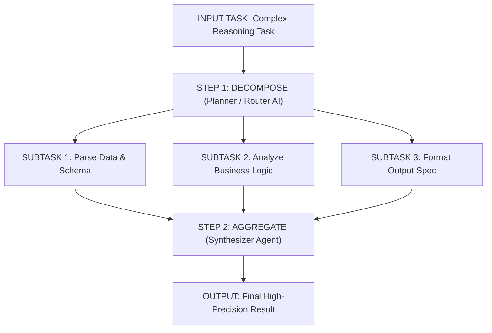
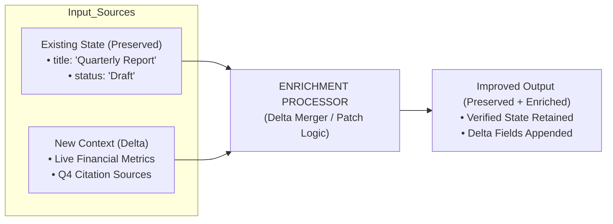
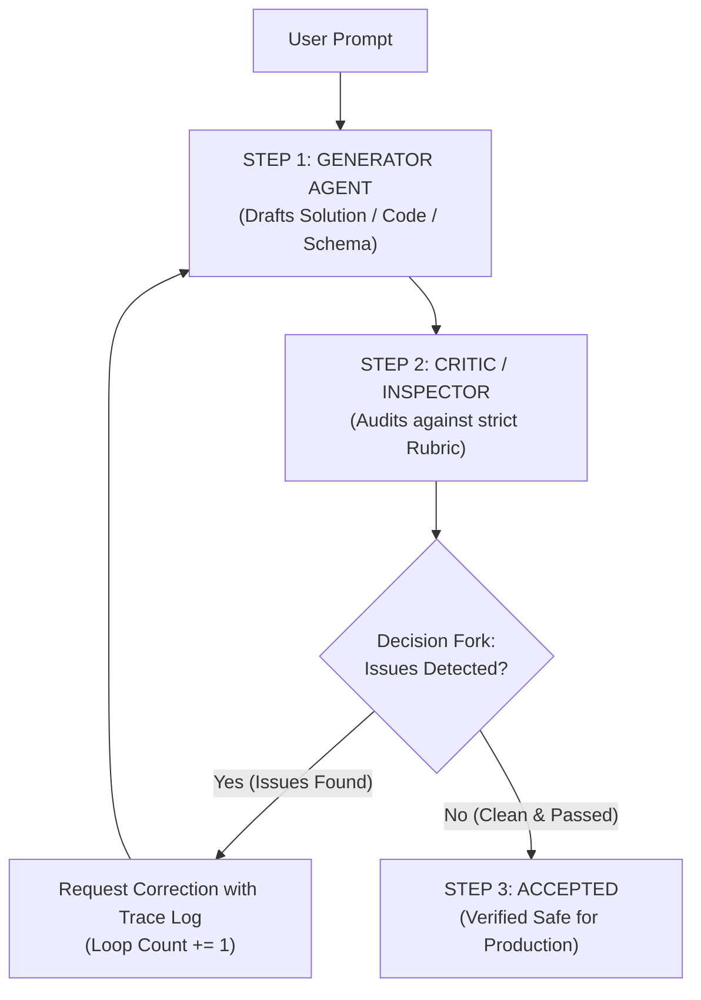

# Mini Patterns for Stable AI Workflows
> **Architectural Guide for Reliable Agentic Systems**  
> *Kiến trúc mẫu thiết kế quy trình AI ổn định, cách ly lỗi và bảo toàn trạng thái suy luận.*

---

## 📌 Tổng Quan (Executive Summary)

Việc phụ thuộc vào các lượt gọi LLM đơn khối (*brittle monolithic LLM calls*) là nguyên nhân hàng đầu gây thất bại trong các ứng dụng AI production. Khi một prompt duy nhất phải gánh vác quá nhiều trọng trách (đọc hiểu, tính toán logic, tuân thủ định dạng, gọi công cụ, xử lý ngoại lệ), mô hình dễ dàng rơi vào trạng thái ảo giác (*hallucination*), nghẽn ngữ cảnh (*context collapse*), hoặc mất kiểm soát hành vi.

Bộ **4 Mini Patterns** cung cấp các nguyên tắc kiến trúc nhẹ (*lightweight design patterns*) giúp kiểm soát độ phức tạp, cách ly các chế độ lỗi, và duy trì trạng thái dự đoán được cho hệ thống AI.

### Triết Lý Hợp Nhất (Unifying Philosophy)
> *"Decompose complexity, preserve useful state, verify continuously, and isolate problems without disrupting the main workflow."*  
> *(Phân rã độ phức tạp, bảo toàn trạng thái hữu ích, xác minh liên tục và cách ly sự cố mà không làm gián đoạn luồng thực thi chính).*

---

## 📊 Ma Trận So Sánh Các Mẫu Kiến Trúc (The Pattern Matrix)

| Mẫu Kiến Trúc (Pattern) | Mục Tiêu (Purpose) | Cơ Chế Cốt Lõi (Core Mechanism) | Khi Nào Sử Dụng (When to Use) |
| :--- | :--- | :--- | :--- |
| **01. Divide & Conquer** | Kiểm soát độ phức tạp (*Control complexity*) | Phân tách tác vụ lớn thành các nhiệm vụ con độc lập $\rightarrow$ Chạy song song/tuần tự $\rightarrow$ Hợp nhất (*Aggregate*). | Xử lý tài liệu nhiều bước, tổng hợp mã nguồn quy mô lớn, phân tích dữ liệu đa chiều. |
| **02. Enrichment, Not Replacement** | Bảo toàn độ ổn định (*Preserve stability*) | Cập nhật có chọn lọc và mở rộng trạng thái hiện có với ngữ cảnh mới thay vì tái tạo lại từ đầu (*zero-shot regeneration*). | Tích hợp công cụ tìm kiếm thời gian thực, cập nhật trường dữ liệu trong JSON schema, tinh chỉnh bản thảo. |
| **03. Reflection Loop** | Bắt lỗi & triệt tiêu ảo giác (*Catch errors & hallucinations*) | Tách biệt mô hình sinh (*Generator*) và mô hình kiểm định (*Critic*) $\rightarrow$ Đánh giá theo rubric $\rightarrow$ Sửa đổi trước khi phát hành. | Kiểm tra cú pháp mã nguồn, xác thực tuân thủ chính sách (*compliance*), kiểm tra suy luận logic/toán học. |
| **04. Branch $\rightarrow$ Resolve $\rightarrow$ Merge** | Cách ly sự cố (*Isolate failures*) | Tách nhánh (*Fork*) luồng chính $\rightarrow$ Xử lý vấn đề phụ trong môi trường độc lập $\rightarrow$ Hợp nhất bản vá đã xác minh về luồng chính. | Agent tự hành chạy tác vụ dài hạn, vòng lặp gỡ lỗi cục bộ, thăm dò công cụ tùy chọn (*tool discovery*). |

---

## 1. Pattern 01: Divide & Conquer (Chia Để Trị)

### Nguyên Lý Cốt Lõi
> **CORE PRINCIPLE:** Độ phức tạp sẽ dễ dàng kiểm soát, gỡ lỗi và mô hình hóa chính xác hơn khi được cách ly thành các đơn vị tính toán nhỏ hơn.

Thay vì yêu cầu một mô hình LLM giải quyết toàn bộ bài toán phức tạp trong một lượt prompt duy nhất, quy trình sẽ phân tách logic thành 3 bước xác định:



### Các Bước Thực Thi
1. **Decompose (Phân rã):** Mô hình Planner nhận câu lệnh có entropy cao của người dùng và bóc tách thành một mảng các sub-prompts có cấu trúc rõ ràng.
2. **Solve Independently (Thực thi độc lập):** Các subtasks được phân bổ cho các worker chuyên biệt (hoặc LLM call nhẹ hơn, nhanh hơn) chạy song song hoặc tuần tự trong ngữ cảnh hẹp.
3. **Aggregate (Tổng hợp):** Mô hình Synthesizer nhận đầu ra có cấu trúc (structured schemas) từ các bước con và ghép nối thành câu trả lời hoàn chỉnh cuối cùng.

### Lợi Ích Kỹ Thuật
- **Giảm Token Context Load:** Mỗi tác vụ con chỉ nhận đúng ngữ cảnh cần thiết, loại bỏ nhiễu thông tin (*context dilution*).
- **Khả Năng Cache & Retry Cục Bộ:** Nếu một subtask thất bại, chỉ cần gọi lại subtask đó thay vì chạy lại toàn bộ pipeline tốn kém.

---

## 2. Pattern 02: Enrichment, Not Replacement (Bổ Sung, Không Thay Thế)

### Nguyên Lý Cốt Lõi
> **CORE PRINCIPLE:** Cải tiến gia tăng (*incremental improvement*) giúp bảo toàn trạng thái, tránh hiện tượng suy sụp ngữ cảnh (*context collapse*), và giảm độ trễ so với việc viết lại toàn bộ.

Trong các tác vụ cập nhật trạng thái (ví dụ: bổ sung số liệu tài chính vào báo cáo, cập nhật thông tin người dùng vào hồ sơ), việc đưa toàn bộ văn bản cũ vào prompt và yêu cầu LLM "viết lại kèm dữ liệu mới" thường dẫn đến sai lệch phong cách viết, mất mát các chi tiết đã được thẩm định trước đó, hoặc tự ý bịa đặt nội dung.



### Các Bước Thực Thi
1. **Preserve Output (Bảo tồn đầu ra đã kiểm định):** Khóa cứng (*lock/freeze*) các trường dữ liệu hoặc cấu trúc văn bản đã được kiểm tra tính đúng đắn.
2. **Inject Context (Nạp ngữ cảnh bổ trợ):** Truy xuất dữ liệu động từ API ngoài, kết quả tìm kiếm (RAG), hoặc thông tin người dùng mới.
3. **Delta Update (Cập nhật vi sai):** Chỉ yêu cầu mô hình sinh ra các trường bổ sung hoặc áp dụng *JSON patch* / *diff merge*, không cho phép mô hình viết đè lên phần nền tảng.

### Ví dụ Cấu Trúc
```json
// Existing Preserved State
{
  "report_id": "REP-2026-Q4",
  "author": "SecOps Team",
  "architecture_summary": "FSM-backed agentic governance with MLflow observability."
}

// Delta Injected via Enrichment
{
  "metrics": {
    "system_reliability": "99.4%",
    "token_reuse_ratio": "78%"
  },
  "verified_sources": ["SEC-10K", "Langfuse Traces"]
}
```

---

## 3. Pattern 03: Reflection Loop (Vòng Lặp Phản Biện & Tự Hiệu Chỉnh)

### Nguyên Lý Cốt Lõi
> **CORE PRINCIPLE:** Tách riêng khâu tạo lập (*generation*) khỏi khâu xác thực (*verification*). Mô hình tự kiểm định đầu ra dựa trên bộ tiêu chí xác định trước khi phê duyệt phát hành.



### Các Bước Thực Thi
1. **Generate (Khởi tạo):** Agent Generator tạo ra bản nháp ban đầu (ví dụ: mã nguồn giải thuật, câu lệnh SQL, bản dịch).
2. **Reflect / Inspect (Phản biện):** Agent Critic độc lập kiểm tra bản nháp theo **Rubric cụ thể**:
   - Kiểm tra syntax / schema.
   - Kiểm tra các trường hợp biên (*boundary cases*, giá trị `null`, chuỗi rỗng).
   - Kiểm tra các ràng buộc bảo mật (*injection attack, data leak*).
3. **Correct or Accept (Hiệu chỉnh hoặc Phê duyệt):**
   - Nếu phát hiện lỗi: Trả về feedback cụ thể cho Generator để sinh bản vá.
   - Nếu đạt yêu cầu: Phê duyệt chuyển tiếp sang bước tiếp theo.

> [!IMPORTANT]
> **Loop Cap Guardrail:** Luôn thiết lập ngưỡng chặn vòng lặp tối đa từ **3 đến 5 lần**. Nếu sau số lần này bản thảo vẫn không vượt qua khâu kiểm duyệt, hệ thống phải ngắt chu trình và kích hoạt cơ chế fallback hoặc gửi cảnh báo cho con người can thiệp (HITL) nhằm ngăn chặn **Over-Thinking Burnout**.

---

## 4. Pattern 04: Branch $\rightarrow$ Resolve $\rightarrow$ Merge (Phân Nhánh $\rightarrow$ Giải Quyết $\rightarrow$ Hợp Nhất)

### Nguyên Lý Cốt Lõi
> **KEY IDEA:** Giữ luồng thực thi chính (*primary workflow thread*) luôn chạy an toàn, không bị nghẽn (non-blocking). Khi gặp phải tình huống ngoại lệ, lỗi phát sinh hoặc bài toán con chưa rõ ràng, hãy tách một nhánh phụ (*fork sub-branch*), giải quyết và kiểm định độc lập, sau đó mới hợp nhất kết quả sạch về luồng chính.

Mô hình này mô phỏng trực tiếp quy trình phân nhánh **Git-Style DAG (Directed Acyclic Graph)**:

```
Main Pipeline:    [ c1: Initial Context ] ─────────▶ [ c2: Main Stays Active ] ─────────▶ [ c3: Fast-Forward Merge ]
                          │                                                                       ▲
                          │ (Fork on ambiguity/error)                                             │
Sub-Agent Branch:         └────────▶ [ b1: Fork & Isolate ] ──▶ [ b2: Resolve & Validate ] ───────┘
```

### Các Bước Thực Thi
1. **Branch (Phân nhánh):** Khi Agent phát hiện một bước trung gian bị lỗi (ví dụ: thiếu tham số API, schema bị lệch, truy vấn database thất bại), trạng thái hiện tại được đóng băng (*frozen*) và một nhánh con (`feature/isolate-task`) được khởi tạo.
2. **Resolve (Giải quyết trong vùng cách ly):** Một Sub-agent chuyên trách nhận quyền xử lý lỗi cục bộ. Sub-agent này có thể thử nhiều chiến lược khác nhau trong sandbox mà không làm ô nhiễm bộ nhớ ngữ cảnh của luồng chính (*prevents memory poisoning*).
3. **Merge & Continue (Hợp nhất có kiểm soát):** Chỉ khi bản vá hoặc thông tin bổ sung đã được xác thực hoàn toàn (`b2: validated`), kết quả sạch mới được tích hợp vào luồng chính (`c3: merge commit`) để tiếp tục hành trình thực thi.

---

## 🛠️ Trực Quan Hóa Sandbox & Tác Động Định Lượng (Quantitative Impact)

Khi tích hợp đồng thời cả 4 Mini Patterns vào hệ thống Agentic, hiệu suất và độ tin cậy được cải thiện rõ rệt so với các lượt gọi LLM đơn khối truyền thống:

```
+-----------------------------------------------------------------------------------+
|                           METRICS IMPACT OVERVIEW                                 |
+-----------------------------------------------------------------------------------+
|  Chỉ Số Đo Lường (Metric)  |  Monolithic Single-Call  |  4 Mini Patterns Combined  |
+----------------------------+--------------------------+---------------------------+
|  Reliability Rate          |  ~65.0% - 75.0%          |  99.4%                     |
|  Token Reuse Ratio         |  ~10.0%                  |  78.0%                     |
|  Uncontrolled Retries      |  Cao (Run-away loops)    |  0 - 1 (Có Loop Capping)   |
|  Risk of Memory Poisoning  |  Rất cao                 |  Được cô lập hoàn toàn     |
+-----------------------------------------------------------------------------------+
```

### Ba Kịch Bản Ứng Dụng Điển Hình
1. **Refactor Legacy Codebase with Security Patching:**
   - *Divide & Conquer:* Phân tách phân tích AST, kiểm tra lỗ hổng bảo mật và sinh mã thành 3 worker.
   - *Branch & Merge:* Khi gặp module có dependencies phức tạp, fork nhánh gỡ lỗi riêng để kiểm thử unit test trước khi tích hợp vào nhánh chính.
2. **Aggregate & Synthesize Multi-Source Research Papers:**
   - *Divide & Conquer:* Tóm tắt từng bài báo độc lập.
   - *Enrichment:* Giữ nguyên các trích dẫn chuẩn, nạp thêm dữ liệu đối sánh mới.
   - *Reflection:* Kiểm định đối chiếu số liệu trích dẫn để loại bỏ hoàn toàn hiện tượng bịa đặt số liệu.
3. **Automate Enterprise Refund & Dispute Resolution:**
   - *Reflection:* Kiểm tra tính hợp lệ của giao dịch theo quy định ngân hàng.
   - *Branch & Merge:* Khi hồ sơ rơi vào diện nghi vấn gian lận, chuyển hướng sang nhánh điều tra riêng biệt mà không làm treo các phiên xử lý yêu cầu hoàn tiền khác.

---

## 🔗 Liên Kết Tài Liệu Liên Quan
- [Agentic Reliability & Debugging Engineering](file:///Users/tinhluong/work_dir/research_prjs/ai_governance_practices/references_doc/agentic_debug/README.md)
- [Agent Types: LLM Call vs. Workflow vs. Autonomous Agent](file:///Users/tinhluong/work_dir/research_prjs/ai_governance_practices/references_doc/agentic_types/README.md)
- [AI Optimization & Governance Practices](file:///Users/tinhluong/work_dir/research_prjs/ai_governance_practices/references_doc/optimization.md)
