# LLM Quantization — Visual Diagrams

> Mermaid companion to [`presentation_script.md`](presentation_script.md) and [`LLM Quantization Methods Survey.md`](LLM%20Quantization%20Methods%20Survey.md).
> One picture per quantization concept, in deck order. Renders on GitHub, in VS Code (Markdown Preview Mermaid Support), and at <https://mermaid.live>.

---

## 1. The Universal Quantization Pipeline

Every method — INT4/INT8 or FP8/FP4 — is the same round trip: map real values onto a small code set, store the code plus a scale, then reconstruct.

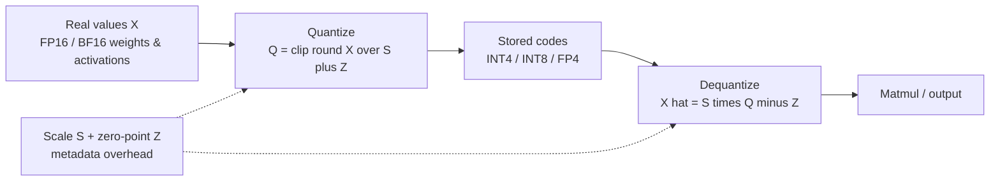

**Takeaway:** the payload is only part of the cost. `S` and `Z` are the *effective bpw* tax — always size with them included.

---

## 2. Quantization Granularity (Where the Error Comes From)

How many values share one scale factor determines the accuracy-vs-overhead trade-off.

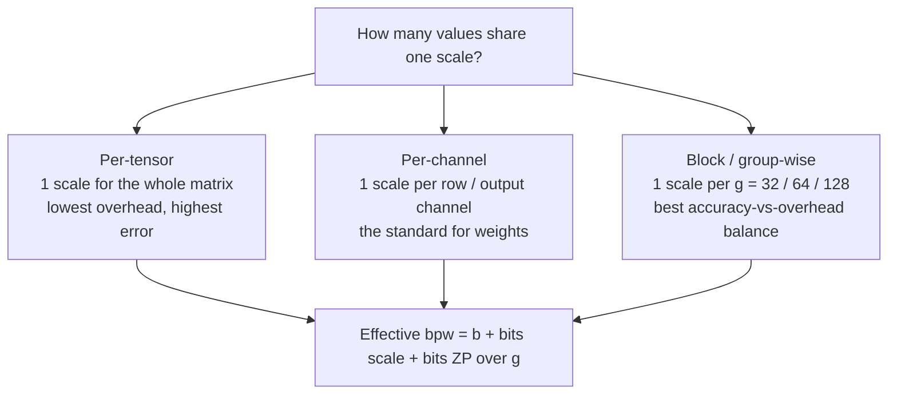

| Scheme | Element bits | Scale metadata | Group | Effective bpw |
| :--- | :--- | :--- | :--- | :--- |
| INT4 + FP16 scale | 4 | 16 | 128 | 4.125 |
| MXFP4 (E8M0) | 4 | 8 | 32 | **4.25** |
| NVFP4 (E4M3 + FP32 outer) | 4 | ~8 | 16 | **~4.5** |
| GGUF Q4_K_M (mixed 4/5/6-bit) | 4–6 | 6-bit superblock | 32 | **~4.85** |

---

## 3. Strategy: PTQ vs. QAT (and PE-QAT)

Two ways to get from a high-precision model to a low-bit one.

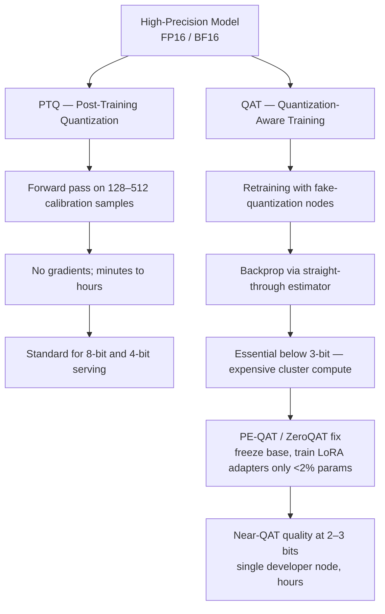

**Takeaway:** PTQ is free and covers ~95% of deployments down to 4-bit. Below that, PE-QAT gets near-QAT quality without a cluster bill.

---

## 4. LLM.int8(): Outlier Channel Decomposition

Why naive INT8 breaks — and the split that fixes it.

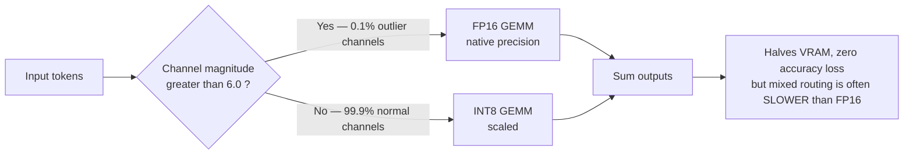

**Takeaway:** use it to *fit* a model on a tight GPU, never expecting a speedup.

---

## 5. QLoRA & NF4: Fine-Tuning on a Single GPU

Frozen 4-bit base + small FP16 adapters.

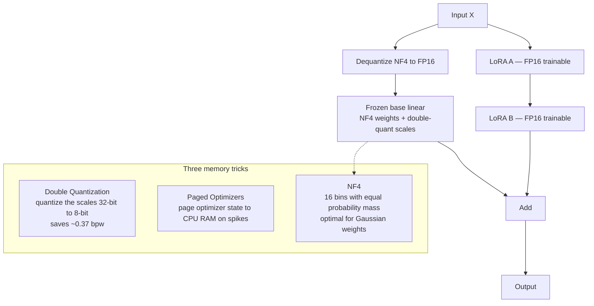

**Takeaway:** 65B fine-tuned on a single 48GB GPU, matching full 16-bit quality.

---

## 6. GPTQ: Second-Order Error Compensation

Quantize one column, then let the *remaining* weights absorb the error.

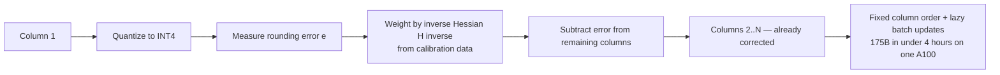

---

## 7. AWQ: Activation-Aware Weight Quantization

Protect the salient 1% with a mathematically identical rescale.

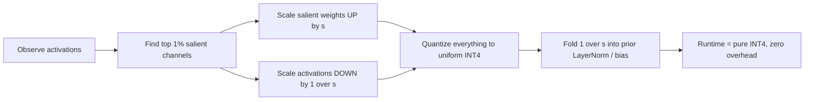

**Takeaway:** `(X / s) · (W · s)` is an identity; the trick is that the *weights* now round more gently.

---

## 8. SmoothQuant: Migrating Difficulty from Activations to Weights

For W8A8, activations are the bottleneck — move the pain into the weights.

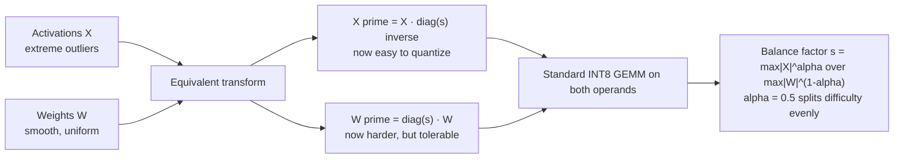

---

## 9. QuaRot & SpinQuant: Orthogonal Rotations for W4A4

Channel scaling is not enough at 4-bit — disperse the outliers instead.

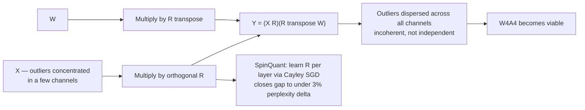

---

## 10. FP8: E4M3 vs. E5M2

Same 8 bits, two different trades between precision and range.

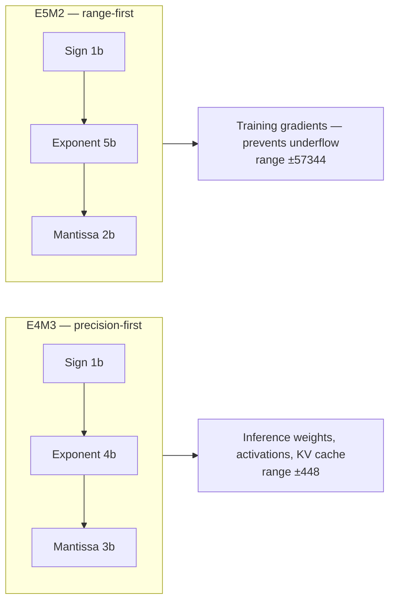

**Takeaway:** floats beat integers at 8-bit because the exponent absorbs outliers natively; dynamic per-token scaling handles the rest.

---

## 11. OCP Microscaling (MX): One Scale per 32 Elements

The cross-vendor open standard.

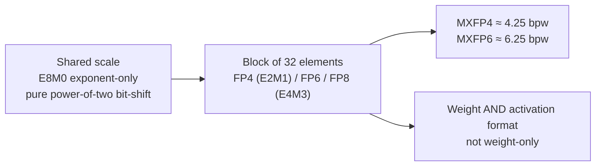

---

## 12. NVFP4: Two-Level Scaling on Blackwell

Fix FP4's tiny ±6 range with a scale inside a scale.

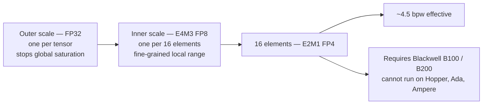

---

## 13. DeepSeek-V3: Fine-Grained FP8 Pre-Training

The tiling that keeps FP8's short accumulator honest over long reductions.

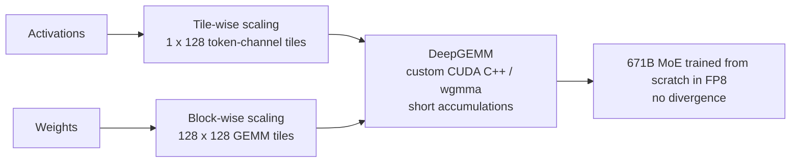

---

## 14. KV Cache: Size It Right, Then Quantize It

Two independent decisions, in order.

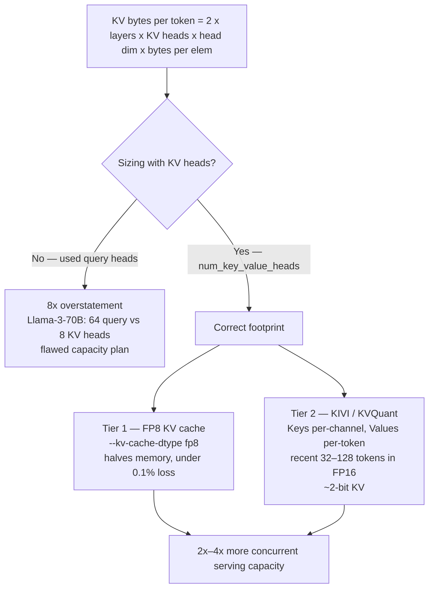

---

## 15. Local & Edge: MLX vs. GGUF

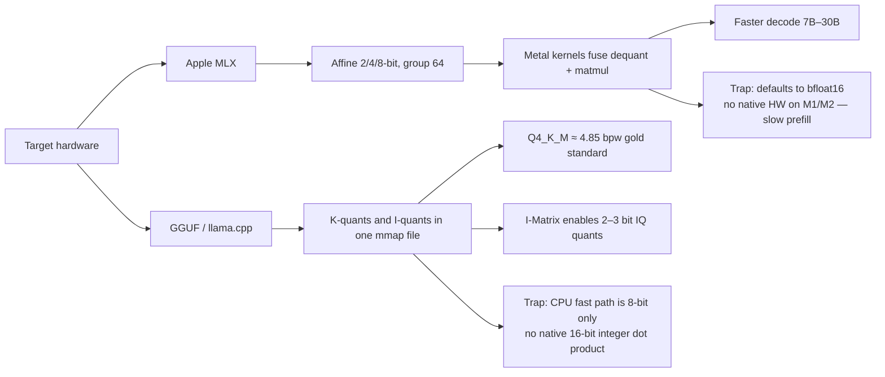

---

## 16. GGUF K-Quant Superblock Layout

How ~4.85 bpw is actually spent.

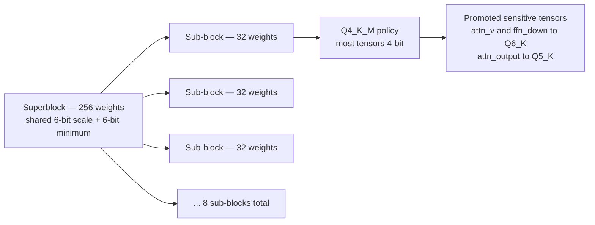

---

## 17. Decision Flowchart (Mermaid edition)

The closing slide of [`presentation_script.md`](presentation_script.md), as a renderable graph.

```mermaid
flowchart TD
    START{"Primary deployment target?"}

    START --> CLOUD["Enterprise Cloud<br/>Hopper / Ada / Blackwell"]
    START --> WS["Consumer Workstation<br/>RTX 3090 / 4090 / 5090"]
    START --> EDGE["CPU / Local Mac / Edge"]

    CLOUD --> BW{"Blackwell?"}
    BW -->|"Yes — B100 / B200"| NVFP4["NVFP4 via TensorRT-LLM<br/>max compute throughput"]
    BW -->|"No — H100 / L40S"| CONC{"High concurrency<br/>batch greater than 32?"}
    CONC -->|"Yes"| FP8["FP8 W8A8 via vLLM / SGLang"]
    CONC -->|"No — VRAM bound"| AWQ1["AWQ W4A16 with Marlin kernels"]

    WS --> WSC{"What for?"}
    WSC -->|"Serving / low latency"| AWQ2["AWQ W4A16 via vLLM"]
    WSC -->|"Fine-tuning"| QLORA["QLoRA with NF4<br/>bitsandbytes"]

    EDGE --> EDC{"Priority?"}
    EDC -->|"Standard"| Q4KM["GGUF Q4_K_M<br/>llama.cpp / Ollama"]
    EDC -->|"Max accuracy"| Q5KM["GGUF Q5_K_M"]
    EDC -->|"Extreme VRAM, under 3.1 bpw"| IQ["GGUF IQ3_XXS<br/>with I-Matrix"]